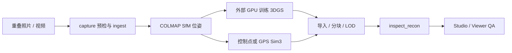

# Nantai 3D Studio

照片与视频驱动的 3D 重建、Gaussian Splat 导入/拼接、可替换山村素材和浏览器漫游工作台。

本仓库负责重建外围的可复现编排与审计：输入预检、图视频摄取、COLMAP 位姿、坐标/尺度契约、
外部 3DGS 训练产物导入、分块/LOD、Viewer 与 Studio。没有真实运行时或证据时，系统会明确
标记 `synthetic / mock / preview-only`，不会把演示结果冒充真实重建。

> 当前已有可漫游的 synthetic 场景和完整验证框架，但真实场景验收仍缺真实重叠采集、
> accepted real-photo SfM、非 mock 云 GPU 3DGS、实测对齐和真实 Viewer QA。

## 能力与边界

| 能力 | 状态 | 边界 |
|---|---|---|
| 图片/视频摄取 | verified | 混合输入归一化、抽帧、模糊筛选和 source/session 绑定 |
| COLMAP 配准 | optional runtime | 有真实 COLMAP 时读取相机/位姿/覆盖率；否则只允许显式 mock |
| 坐标与米制对齐 | fail-closed | 裸 SfM 保持 arbitrary/unaligned；控制点或 GPS Sim3 通过门后才可提升 |
| 3DGS 导入与拼接 | verified | frame、units、transform history 一致后才 merge |
| SH/旋转/LOD/分块 | verified | 高阶 SH degree 0–3、空间分块、区域替换和三级 LOD |
| Viewer | verified with fallback | Spark 2.1.0 完整渲染；不可用时明确降级为 DC point preview |
| Studio | verified local snapshot | 项目状态、provenance、LOD/图层、覆盖审计和 production-plan HUD |
| 可替换素材 | verified inputs | 11 个程序素材、68 个 synthetic 视觉槽位、164 张设计板；见 [Release 索引](docs/releases/synthetic-design-inputs.md) |
| 180 机位计划 | plan verified | 机位计划不是渲染质量、真实 coverage 或训练成功的证据 |
| 3DGS 训练 | external | 本仓库不自研训练器；本机 Brush 只适合小规模试验，高质量主路径为云 GPU |

## 快速开始

需要 Python 3.11+、Node.js 20+。Linux/macOS：

```bash
python3 -m venv .venv
.venv/bin/python -m pip install -e ".[dev]"

make assets PY=.venv/bin/python
make ingest PY=.venv/bin/python
make reconstruct PY=.venv/bin/python
make world PY=.venv/bin/python
make serve PY=.venv/bin/python
```

Windows 或没有 GNU make 时使用跨平台任务入口：

```powershell
python -m venv .venv
.venv\Scripts\python -m pip install -e ".[dev]"

.venv\Scripts\python make.py assets
.venv\Scripts\python make.py ingest
.venv\Scripts\python make.py reconstruct
.venv\Scripts\python make.py world
.venv\Scripts\python make.py serve
```

Studio 默认地址：<http://127.0.0.1:8000/>

以上 `reconstruct` 快速路径允许 synthetic mock，只用于验证管线。开始真实任务前先运行：

```powershell
.venv\Scripts\python make.py doctor
$env:PHOTOS = "input"
.venv\Scripts\python make.py check-capture
Remove-Item Env:PHOTOS
```

`doctor` 报告本机可用能力；`check-capture` 只做单图质量预检，不能证明照片之间有足够重叠。

## 从真实素材到可漫游场景



关键边界：

1. 视频抽帧不等于配准成功；只看 registration 的逐图覆盖率。
2. COLMAP 输出默认是 `sfm-local / arbitrary / unaligned`。
3. 真实 3DGS 训练需要外部训练器；开发机没有 NVIDIA CUDA。
4. 控制点/GPS 对齐必须通过非退化、正尺度和 RMS 门，失败时不提升为米制 ENU。
5. 导入后的 provenance、artifact fidelity 与 Viewer runtime fidelity 分开报告。

完整安装、云 GPU、命令和耗时边界：

- [端到端重建手册](docs/manual/reconstruction-setup.md)
- [真实数据工作流与坐标契约](docs/real-data-workflow.md)

## Synthetic 演示与设计素材

- `make assets` 生成、验收并注册 11 个确定性程序素材。
- `make world` 生成带来源与消费证据的 synthetic 分块世界。
- 68 个视觉槽位和 Batch 8–32 共 164 张通用设计输入统一列在
  [Synthetic design input Releases](docs/releases/synthetic-design-inputs.md)。

这些素材可以被真实素材逐槽替换，但不能作为真实照片、多视图训练集、米制尺度或 360°
coverage 证据。Release 只保留最终 PNG、prompt/提示链、manifest、USAGE 和 checksum；
生成队列、失败请求、候选中间态与 contact sheet 不发布。

## Viewer 与 Studio

`make serve` 或 `python make.py serve` 启动本地服务器：

- Studio：`/web/studio/`
- Viewer：`/web/viewer/`
- Project API：`GET /api/project`
- Runs API：`GET /api/runs`

Studio 从 Viewer bridge 读取实际 runtime capability。只有 Spark 初始化成功后才显示完整
anisotropic covariance、alpha composite 和 spherical harmonics；fallback 不会伪装成完整
3DGS。Production camera plan 与 coverage audit 也不会提升 reconstruction provenance。

## 可信度模型

- 信任只从机器字段、内容 SHA、transform history 和实测报告推导，不从文件名或 engine 名推断。
- `synthetic=true` / `mock-proxy` 只代表流程演示。
- `preview-only` 不允许测量；`full-3dgs` 只描述文件属性，不保证 Viewer 已完整渲染。
- `registered` 不等于素材已被场景消费；消费需要 build/render report 和匹配 SHA。
- 真实 reconstruction chunk 没有程序化 `grid`，绝不能投影为 `on_demand:true`。
- 矛盾、缺证据或无法解析时保持低信任并 fail closed。

主要产物：

- `recon/registration.json`：相机、位姿、session、frame 与 registration evidence。
- `recon/scene_full.ply`：完整导入/拼接结果。
- `web/data/recon/recon_manifest.json`：artifact、LOD、transform chain 与可信度。
- `web/data/manifest.json`：world bounds、chunks 与素材消费证据。
- `assets/registry.json`：素材版本、历史、payload SHA 与来源。

## 验证

```bash
make test PY=.venv/bin/python
make verify PY=.venv/bin/python
.venv/bin/python -m ruff check pipeline tests
git diff --check
```

Windows：

```powershell
.venv\Scripts\python make.py test lint
git diff --check
```

CI 覆盖 Ubuntu/Windows 与 Python 3.11/3.13，并检查素材和关键 manifest 的跨平台字节一致性。

## 项目结构

```text
pipeline/             摄取、配准、坐标、3DGS、素材、分块与 Studio server
scripts/              本机重建、预检、诊断和转换工具
tests/                合约、fail-closed 与端到端回归
web/viewer/           Spark 3DGS、fallback 和 iframe bridge
web/studio/           reducer/adapter 驱动的工作台 UX
assets/               程序素材、registry 和版本历史
docs/                 手册、契约、验证、计划与 Release 索引
handoff/              当前协作交办、review 与机器证据
```

## 文档入口

- [真实重建安装与云 GPU 手册](docs/manual/reconstruction-setup.md)
- [真实数据与 Sim3/ENU 对齐](docs/real-data-workflow.md)
- [Synthetic 素材 Release 索引](docs/releases/synthetic-design-inputs.md)
- [Studio adapter snapshot schema](docs/contracts/studio-adapter-v2.schema.json)
- [接管背景与未决项](handoff/TAKEOVER-2026-07-14.md)

历史实现过程和逐批审计留在 `handoff/` 与 `docs/verification/`，README 只维护当前能力、
真实边界、最短使用路径和权威索引。
