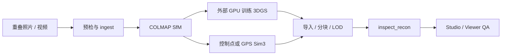

# Nantai 3D Studio

照片与视频驱动的 3D 重建、Gaussian Splat 导入/拼接、可替换场景素材和浏览器漫游工作台。

本仓库负责输入预检、COLMAP 位姿、坐标与尺度契约、外部 3DGS 产物导入、分块/LOD、
Viewer 和 Studio。证据不足时始终标记为 `synthetic`、`mock` 或 `preview-only`，
不会把演示结果冒充真实重建。

> **当前状态：** synthetic 场景与验证框架可运行；真实场景验收仍缺真实重叠采集、
> accepted real-photo SfM、非 mock 云 GPU 3DGS、实测对齐和真实 Viewer QA。

## 核心能力

| 能力 | 当前边界 |
|---|---|
| 图片/视频摄取 | 输入归一化、抽帧、质量预检和 source/session 绑定 |
| COLMAP 与坐标 | 可消费真实位姿；裸 SfM 保持 arbitrary/unaligned，通过控制点或 GPS 门后才提升 |
| 3DGS 处理 | 导入、拼接、高阶 SH 旋转、空间分块和三级 LOD |
| Viewer / Studio | Spark 3DGS、明确标注的 fallback、项目状态与 provenance 审计 |
| Synthetic 世界 | 可替换素材、确定性分块、按需生成和路线图；不代表真实 coverage |
| 3DGS 训练 | 外部能力；高质量主路径需要云端 NVIDIA GPU |

## 快速预览

需要 Python 3.11+ 和 Node.js 20+。Windows：

```powershell
python -m venv .venv
.venv\Scripts\python -m pip install -e ".[dev]"
.venv\Scripts\python make.py assets world
.venv\Scripts\python make.py serve
```

Linux/macOS 将虚拟环境路径替换为 `.venv/bin/python`，也可使用同名 `make` target。
启动后打开 <http://127.0.0.1:8000/web/studio/>。

## 真实数据工作流

真实任务开始前先检查本机运行时和采集质量：

```powershell
.venv\Scripts\python make.py doctor
$env:PHOTOS = "input"
.venv\Scripts\python make.py check-capture
Remove-Item Env:PHOTOS
```



- 视频抽帧不等于配准成功，必须检查逐图 registration coverage。
- `check-capture` 只做单图预检，不能证明照片之间有足够重叠。
- 本仓库不包含高质量 3DGS 训练器；开发机无 NVIDIA CUDA。
- 对齐或证据门失败时，不提升为米制、ENU 或 measured。

## 可信度原则

- 信任只由机器字段、内容 SHA、transform history 和实测报告推导。
- `preview-only` 不允许测量；`full-3dgs` 也不等于 Viewer 已完整渲染。
- 素材已登记不等于已被场景消费，仍需匹配的 build/render report。
- 矛盾、缺失或不可解析的证据一律 fail closed。

## 验证

```powershell
.venv\Scripts\python make.py test lint
git diff --check
```

## 文档

- [端到端重建、COLMAP 与云 GPU 手册](docs/manual/reconstruction-setup.md)
- [真实数据工作流与 Sim3/ENU 坐标契约](docs/real-data-workflow.md)
- [Synthetic 素材 Release 与使用说明](docs/releases/synthetic-design-inputs.md)
- [Studio adapter snapshot schema](docs/contracts/studio-adapter-v2.schema.json)

历史实现、阶段审计和多智能体交接保留在 `docs/verification/`、`docs/superpowers/`
与 `handoff/`，不作为首次使用入口。
