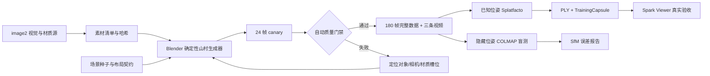

# 通用合成山村多视角数据集设计

日期：2026-07-15

状态：用户已批准设计方向、数据规模和验收门禁；等待书面规格复核后再编写实施计划

## 1. 决策摘要

采用 image2 与 Blender 的混合方案，分别解决视觉质量和几何一致性：

- image2 负责山村视觉设计、关键视图、材质源图、细节参考和图像处理；
- Blender 负责确定性场景几何、精确相机、深度、法线、实例和语义真值；
- Blender RGB 与精确相机参数形成可训练的 synthetic 多视角数据集；
- image2 图片只作为视觉和材质依据，不混入 Blender 相机序列冒充几何一致照片；
- 已知位姿链验证 Nerfstudio/Splatfacto 训练，隐藏位姿链独立验证 COLMAP；
- 训练出的 Gaussian PLY 必须经 Spark Viewer 真实加载和漫游验收，才能证明这套合成输入支持了 3D 场景生成。

所有数据仍为 `synthetic / L2`。即使 COLMAP、3DGS 和 Viewer 全部通过，也不能提升为真实世界 measured。

## 2. 背景与问题

当前 image2 已生成两版通用山村总览，其中第二版扩大到中型山村。它们适合表达设计方向，但单独生成的图片无法保证跨视角建筑位置、遮挡、相机内参和尺度完全一致。直接继续堆积 image2 视图可以提高视觉丰富度，却不能可靠支撑 SfM 或 3DGS 训练。

项目需要同时满足两类要求：

1. 多角度、多细节、多元素和足够数量的高质量视觉素材；
2. 能够证明输入具备一致几何、可恢复位姿、可训练 3DGS 和可在 Viewer 中漫游。

混合方案让两类证据互不冒充，并通过统一 manifest、hash 和替换契约协作。

## 3. 目标

1. 生成一个约 `700m × 500m`、垂直落差约 `120m` 的通用山村 synthetic seed region。
2. 场景包含 60–80 栋建筑、三个聚落组团、完整路径网络和丰富自然/生产元素。
3. 交付 180 个精确相机位的 RGB、深度、法线、实例遮罩、语义遮罩和相机参数。
4. 交付三条连续路线视频，覆盖图片和视频两种 ingest 入口。
5. 让相机、对象、材质、语义、空间分区和文件都拥有稳定 ID 与哈希。
6. 用已知位姿训练和 COLMAP 盲测分别证明训练链和 SfM 链。
7. 在当前 Intel UHD 770 目标机上完成 Spark Viewer 的真实加载与漫游验收。
8. 保持所有素材通用、可替换、无真实村名、无真实坐标、无个人或品牌身份。

## 4. 非目标

- 不把 image2 图片描述成同一真实相机系统拍摄的照片。
- 不用合成数据证明真实村庄的还原质量。
- 不在该切片内实现无限世界、自动生成任意相邻村庄或跨地域连续地形。
- 不在本地训练新的图像或 3D 生成模型。
- 不引入需要未知许可证的外部模型、贴图包或 Blender 插件。
- 不为满足“数量”而生成重复帧、静止长视频或没有视差的图片。
- 不用 mock proxy、COLMAP 注册率或 PLY 文件存在单独冒充完整 3D 成功。

## 5. 方案比较

### 5.1 仅 image2

优点是照片感和细节最强，能快速产生大量构图。缺点是视角之间会发生建筑数量、位置、遮挡和尺度漂移，不适合作为权威多视角几何输入。因此仅保留为视觉参考线。

### 5.2 仅 Blender

优点是相机和几何完全可控。缺点是如果完全依赖程序材质和简单资产，视觉容易重复且缺乏真实质感。它适合作为 ground truth，但不应单独承担视觉设计。

### 5.3 image2 + Blender

这是批准方案。image2 生成设计和材质源，Blender 用稳定规则把设计翻译成可验证的 3D 场景，并渲染精确多视角数据。两条输入在 provenance 中分开，最终在同一数据集 manifest 中关联。

## 6. 总体架构



实现边界分为六个独立单元：

- `VisualSourcePack`：image2 图片、prompt、引用和哈希；
- `VillageSceneSpec`：场景尺度、元素预算、布局 seed 和空间分区；
- `BlenderSceneBuilder`：只根据已验证输入生成场景和稳定对象 ID；
- `CameraPlan`：生成、校验并分割 train/val/test 相机；
- `DatasetRenderer`：按帧输出所有图层并支持断点续作；
- `DatasetVerifier`：验证文件、几何、覆盖、SfM、3DGS 和 Viewer 证据。

这些单元通过版本化 JSON manifest 通信，不通过 Blender UI 状态或目录名猜测成功。

## 7. 私有目录与发布布局

正式运行时数据保存到 Git 已忽略的 `.nantai-studio/` 根下：

```text
.nantai-studio/synthetic-village/
  hybrid-v3/
    source-image2/
      key-views/
      materials/
      details/
      environment/
      props/
      visual-source-manifest.json
    scene/
      village.blend
      scene-manifest.json
      object-registry.json
      material-registry.json
      spatial-cells.json
    dataset/
      canary/
      full/
      colmap-blind/
    video/
      canary/
      full/
    reports/
    dataset-manifest.json
```

当前 `input/mock-village/image2-2026-07-15-v1/` 和 `v2/` 是已存在的 Git 忽略视觉草案。实施时按 hash 导入 `VisualSourcePack`，但不把该目录继续扩展成正式数据集存储。

生成过程写入 `.nantai-studio/work/<run-id>/` 或版本化私有 staging。只有完整 manifest、所有哈希和要求门禁通过后，才发布到最终版本目录。旧版本不覆盖、不原地修补。

当前 B1 兼容模式如果仍只能扫描项目 `input/`，必须从已验证 DatasetRevision 创建一个临时、受控的 ingest 投影，其中只包含选定 RGB 图片或选定视频。深度、法线、mask、材质源、manifest 和训练输出不得进入该投影。B2 完成后由 CaptureRevision/DatasetDescriptor ID 直接选择数据集，不再通过任意目录猜测输入。

公共 Git 只允许保存生成器、schema、提示词模板、测试和不含私有 payload 的文档。生成图、`.blend`、RGB、深度、视频、PLY、数据库和日志不入库。

## 8. 山村场景契约

### 8.1 坐标与范围

- 坐标系：右手、Z-up、米制；
- 目标地形边界：约 `700m × 500m`；
- 目标垂直落差：约 `120m`；
- 原点位于中心组团附近的稳定地表锚点；
- near/far、场景 AABB、地表高度场和水面高度必须写入 manifest；
- 所有对象 transform 必须为有限值，尺度为正，父子变换可解析。

### 8.2 聚落与建筑

总建筑数量为 60–80 栋，分成三个有连通路径但空间可辨识的组团：

1. 溪边组团：桥梁、低地住宅、菜地和水边路径；
2. 中心组团：两个相连院落、主要晒场和一座克制的公共建筑；
3. 上坡组团：沿等高线和折返石阶分布的住宅、梯田与果园。

建议元素预算：

| 元素 | 数量/要求 |
|---|---|
| 住宅建筑 | 45–60 栋，体量、朝向、院墙和屋顶自然变化 |
| 附属建筑 | 10–16 栋，仓房、棚屋或小型生产空间 |
| 公共建筑 | 1–2 栋，与整体乡土材料一致，不做地标化大庙 |
| 院落/晒场 | 至少 12 处，其中 2 处形成中心公共空间 |
| 桥梁 | 2 座石桥，尺寸和跨径不同 |
| 溪流/水塘 | 1 条连续溪流、1 个灌溉水塘和若干浅沟 |
| 梯田/菜地 | 覆盖多个高程层级，不使用单一重复贴片 |
| 果园/竹林 | 各至少 2 片，形成不同视觉和遮挡特征 |
| 路线 | 一条主步道、多个支路、台阶和田埂连接全部组团 |
| 通用细节 | 木柴、农具、石凳、水缸、围栏等，不绑定具体居民身份 |

建筑使用深灰旧瓦、浅色灰泥、夯土、木门窗、石基和挡土墙等通用材料。实例必须有稳定 ID，不可通过随机复制生成肉眼明显的克隆排布。

### 8.3 空间扩展边界

该山谷是有限 seed region，不宣称已经无限。场景逻辑上划分为 `4 × 3` 共 12 个 `spatial_cell`，记录 cell bounds、主要对象、相邻 cell 和边界连接锚点。第一版仍可整体训练和导出一个 PLY；cell 契约为后续空间 artifact、LOD 和相邻场景扩展预留稳定接口。

## 9. image2 素材契约

image2 素材分为五类：

| 类别 | 数量 | 用途 |
|---|---:|---|
| 关键视觉图 | 12–16 | 三个组团、山谷全景、主要路线和氛围方向 |
| 材质源图 | 20–24 | 墙、瓦、木、石、土、农田和植被表面 |
| 建筑/院落细节 | 12 | 门窗、檐口、墙脚、院墙、铺地和排水 |
| 环境元素 | 8 | 桥、溪流、水塘、梯田、果园、竹林和道路 |
| 小型乡村元素 | 8 | 通用农具、木柴、水缸、石凳和围栏参考 |

每张素材记录：

- 稳定 slot 和用途；
- 完整最终 prompt；
- 引用图 SHA-256；
- 输出文件 SHA-256；
- 生成接口和实际可知模型 ID；
- `synthetic=true`；
- 生成时间、编辑链和版本；
- 许可/用途说明。

如果内置接口不暴露精确模型名，`actual_model_id` 必须写 `unknown`。不能从“image2”称呼推断实际模型 ID。

image2 关键视觉不进入 Blender 训练相机目录。材质源在 Blender 中作为显式贴图输入或设计参考，任何派生法线、粗糙度或色彩变换都记录工具、参数和 input/output hash。

## 10. Blender 工具和场景生成

### 10.1 工具选择

使用一个从 Blender 官方来源取得的 Windows 便携构建。最终版本只在下载完成、archive SHA-256 记录、headless help、最小渲染和当前 Intel UHD 770 canary 通过后锁定。不得在规格阶段把一个未安装或未验证版本写成可用能力。

第一版不依赖外部 Blender 插件和未知来源资产包。使用 Blender 内建 Python API、几何节点、材质节点和渲染器。CPU/集显环境优先选择能稳定 headless 输出多图层的渲染配置；是否使用 Eevee 由安装 canary 决定，而不是预先假定 GPU 兼容性。

### 10.2 确定性

场景生成器固定：

- master seed；
- 每个子系统派生 seed；
- Blender 构建身份；
- 脚本 Git commit；
- VillageSceneSpec digest；
- VisualSourcePack digest；
- 对象和材质注册表；
- 所有非确定性节点的显式参数。

相同输入必须产生相同的对象 ID、布局清单、相机清单和预期文件集合。像素级渲染是否完全一致单独记录；驱动或渲染器造成的统计差异不能改变几何、相机或 manifest identity。

### 10.3 场景构建分层

生成顺序固定为：

1. 地形高度场和空间 cell；
2. 水体、农田和主要路径；
3. 三个聚落的建筑 footprint；
4. 建筑体量、屋顶、院墙和挡土墙；
5. 材质分配；
6. 生态和小型细节；
7. 相机候选生成；
8. 可见性、碰撞和覆盖筛选；
9. 灯光、天气和渲染配置；
10. manifest 冻结。

每层拥有独立输入/输出 schema，错误可定位到具体对象或 slot，不通过重新随机生成整个村庄隐藏问题。

## 11. 相机计划

### 11.1 完整数量

完整数据集包含 180 个有效相机：

| 类型 | 数量 | 覆盖目标 |
|---|---:|---|
| 外围环绕与高位视角 | 48 | 完整地形、三组团关系、屋顶和远景 |
| 连续地面漫游 | 60 | 三条主路线及路径两侧建筑 |
| 组团/院落/路口 | 36 | 遮挡变化、立面、公共空间和连接关系 |
| 桥梁/建筑/材质近景 | 24 | 局部几何和高频纹理 |
| 独立留出评测视角 | 12 | 训练未见位置的重建质量 |

最终分层拆分为 144 个 train、24 个 validation 和 12 个 test 相机。val/test 不能只是 train 相机的轻微平移或相邻视频帧。

### 11.2 相机约束

- 地面相机高度通常为 1.5–2.2m，高位相机按场景覆盖规划；
- FOV 和焦距使用少量明确档位，不逐帧无界随机；
- 相邻训练视角目标有效重叠率为 65%–80%；
- 必须保留足够平移视差，不能只有原地旋转；
- 相机不得穿墙、埋入地面、落入水体或进入不可见封闭体；
- 近远裁剪面不应截断主要几何；
- 每个主要建筑至少被三个有效相机观察；
- 三个组团、桥梁、溪流、主要道路和公共空间均应进入 coverage report；
- 相机到世界矩阵、内参、曝光、near/far 和语义路线写入独立文件。

### 11.3 Canary

先从同一 CameraPlan 选择 24 个代表相机，覆盖外围、地面、院落、桥梁、不同高程和材质细节。Canary 使用较低分辨率快速验证场景、材质、相机、图层输出和数据契约。任一硬门禁失败时，完整 180 帧和视频渲染不得开始。

## 12. 每帧输出契约

完整帧输出：

```text
rgb/<camera-id>.png
depth/<camera-id>.<lossless-depth-format>
normal/<camera-id>.<lossless-normal-format>
instance_mask/<camera-id>.png
semantic_mask/<camera-id>.png
camera/<camera-id>.json
frame/<camera-id>.json
```

要求：

- RGB 完整版分辨率为 `2048 × 1152`；
- 深度是从相机定义出发的线性米制深度，并声明无效值；
- 法线声明位于世界空间或相机空间，所有帧一致；
- instance mask 使用稳定对象 ID；
- semantic mask 使用版本化类别表；
- 所有图层尺寸与相机 ID 一致；
- 每帧记录 RGB、辅助图层、相机和场景 manifest 的 hash；
- frame manifest 只有在所有必需文件验证通过后才能标为 verified。

数据集同时输出：

- `transforms_train.json`；
- `transforms_val.json`；
- `transforms_test.json`；
- 相机轨迹与 coverage matrix；
- 对象、材质、语义和实例注册表；
- scene bounds、spatial cells 和连接锚点；
- seed、工具版本、脚本版本和全量 SHA-256；
- 已知位姿训练包和隐藏位姿 COLMAP 盲测包。

## 13. 视频输出

生成三条连续相机路线：

1. 山谷入口经溪边组团到中心组团；
2. 中心组团经折返石阶到上坡组团；
3. 溪流、桥梁、梯田和果园环线。

先为每条路线输出短 canary，再在相机、遮挡和编码契约通过后输出总长约 2–3 分钟的 1080p 视频。路线必须包含真实平移、转向和高程变化，并维持可用于抽帧的清晰度。

FFmpeg/ffprobe 是视频容器、codec、duration、timestamp 和抽帧的权威工具。最终 Windows build 必须锁定来源、版本、archive hash 和 build identity。OpenCV 仅参与像素质量分析，不作为视频事实来源。

不人为填充 20 分钟重复画面。视频 ingest 的价值由有效视差、覆盖和采样质量决定，而不是文件时长或大小。

## 14. 与 Nantai 重建链的连接

### 14.1 已知位姿链

Blender 相机直接转换为 Nerfstudio `transforms_*.json`，连同 RGB、scene manifest 和 toolchain capsule 进入 TrainingHandoff。云端训练必须消费这些固定输入并返回完整 TrainingCapsule、checkpoint 和 PLY hash。

该链证明：

- 图像和相机格式可被训练器消费；
- 真实外部 GPU 训练能够完成；
- 标准 Gaussian PLY 可以导入项目；
- Spark Viewer 可以加载和漫游。

### 14.2 COLMAP 盲测链

复制一套仅含 RGB 和输入清单的盲测包，不向 COLMAP 暴露 Blender 位姿。COLMAP 恢复结果通过 Sim(3) 与 ground truth 对齐，计算注册率、连通组件、旋转误差和相机位置误差。

该链证明 SfM 输入质量，不参与伪造已知位姿链的成功。

### 14.3 Revision 集成

完整数据集进入一个 synthetic CaptureRevision；已知相机和场景 manifest 形成 synthetic evidence bundle；外部训练结果进入 ImportDescriptor；验证通过后生成 synthetic SceneRevision candidate。

SceneRevision 可以诚实声明 artifact fidelity 为 full-3DGS，但 geometry/world provenance 仍是 synthetic，trust 不得提升为 measured 或 metric-aligned real world。

## 15. 故障恢复

### 15.1 image2

- 按 slot 单独生成和保存；
- 每张生成后立即计算 hash 并追加 manifest；
- 网络失败只重试当前 slot；
- 成功文件不因后续失败被删除；
- 新版本不覆盖旧版本；
- 引用图缺失或 hash 变化时派生图失效并要求重建。

### 15.2 Blender 场景

- 场景层按固定顺序执行并记录完成证据；
- 失败定位到 layer、对象或素材 slot；
- 不通过更换随机 seed 掩盖同一输入的失败；
- `.blend` 与 scene manifest 在 staging 中生成；
- 只有对象、材质、cell 和相机清单一致后才冻结场景。

### 15.3 帧渲染

每帧有 `planned/rendering/verified/failed` 的外部状态记录。进程中断后：

- verified 帧按 hash 复用；
- rendering 帧重新生成；
- 缺任一必需图层的帧整体无效；
- 输出存在但 manifest 不匹配时进入 quarantine；
- 完整数据集发布前重新验证所有帧及全局索引。

### 15.4 长任务

下载、解压、hash、Blender headless、FFmpeg、COLMAP、训练监管和 artifact publication 使用 CLI/API/受控 subprocess，不使用 GUI 点击记录作为可复现证据。Computer Use 只用于 GUI-only 安装、授权、云端账号/付款交互和最终视觉验收；账号、2FA、条款、付费和上传在操作时由用户确认。

## 16. 自动质量门禁

### 16.1 文件与 schema

- 所有 manifest 通过版本化 schema；
- 文件集合、尺寸、格式和 SHA-256 完整；
- 没有绝对用户路径、凭据、GPS、真实村名或个人信息；
- train/val/test 无重复 ID 和重复图像 hash；
- RGB、深度、法线和 mask 尺寸一致；
- 深度有限、为正并使用声明单位；
- 相机矩阵有限、正交、可逆且坐标约定一致。

### 16.2 场景与覆盖

- 建筑数量和三个组团满足契约；
- 路径连通三个组团；
- 桥梁、水体、农田、院落和公共空间满足最低元素预算；
- 相机不碰撞、不穿模、不入地、不落水；
- 每个主要建筑至少被三个有效相机观察；
- 相邻训练视角重叠目标为 65%–80%；
- 留出相机与训练相机具有真实空间差异；
- coverage report 不存在完全未观测的必需区域。

### 16.3 确定性

同一 master seed、scene spec、visual source digest、脚本 commit 和工具构建必须产生相同对象 ID、layout manifest、CameraPlan 和预期输出清单。像素差异单独量化，不能改变场景身份。

## 17. COLMAP 盲测验收

完整 RGB 盲测目标：

- 注册图片比例不低于 90%；
- 三个聚落不能恢复成互不关联的主要坐标组件；
- 经 Sim(3) 对齐后，中位旋转误差不超过 `2°`；
- 中位相机位置误差不超过 `2m`，且不超过场景对角线的 `0.5%`；
- 异常图片、重复纹理和错误匹配在报告中可以定位到 camera/object/material ID。

未达到目标时，修改纹理区分度、有效重叠、视差或相机路线。不得注入 Blender 真值或删除失败图片后把同一盲测标绿。

## 18. 3DGS 验收

先使用已知 Blender 位姿完成一次真实外部 Nerfstudio Splatfacto 训练。最低要求：

- 固定 TrainingCapsule 并记录真实 OCI digest 和依赖；
- 成功返回 checkpoint 和标准 Gaussian PLY；
- PLY 不含 NaN/Inf；
- PLY bounds、transform、frame 和单位与 synthetic 场景契约一致；
- 12 个独立 test 视角的起始质量目标为：
  - PSNR 不低于 `22 dB`；
  - SSIM 不低于 `0.75`；
  - LPIPS 不高于 `0.30`；
- 指标未达标时，candidate 不自动推荐激活，并保留实际报告。

这些阈值只用于本数据集的 synthetic canary，不是所有真实场景的万能阈值。若调整，必须先保存旧基线、原因和新阈值审批记录。

## 19. Spark Viewer 验收

在 Intel UHD 770、固定浏览器、1080p 和明确 LOD budget 下记录：

- 首个可用画面目标不超过 `10s`；
- 中位帧率目标不低于 `30 FPS`；
- 低分位帧率目标不低于 `20 FPS`；
- 相机输入响应目标不超过 `100ms`；
- 三条路线可完整走通；
- 不出现大面积空洞、严重闪烁、坐标跳变或进入未生成区域；
- Spark 失败时显式降级，不能把 fallback 提升为 full fidelity。

自动浏览器测试负责确定性加载、相机和截图证据。Computer Use 负责最终肉眼检查破洞、拖影、闪烁、眩晕感和操作手感。两种证据分开记录。

性能不足时先降低 splat/LOD budget 并显示实际 fidelity；不能只隐藏性能数据或更改标签。

## 20. 隐私、许可与公开仓库

- 场景不使用真实村名、地址、GPS 或可识别居民；
- image2 输出禁止文本、品牌、车牌和可识别人物；
- 第一版不引入外部模型和贴图资产包；
- 若未来引入外部资产，必须逐项记录来源、作者、许可、修改和分发限制；
- 真实输入和 synthetic 输入必须位于不同 CaptureRevision；
- 所有 runtime payload 留在 Git 忽略目录；
- 提交前隐私扫描必须确认公共 Git 不含图片、视频、`.blend`、PLY、数据库、日志、绝对路径和凭据。

## 21. 实施切片

书面规格复核后，实施计划应拆为以下可独立验收的切片：

1. 工具锁和官方 Blender 便携版 canary；
2. VisualSourcePack schema、image2 slot 和 provenance manifest；
3. VillageSceneSpec、空间 cell、对象/材质注册表和确定性 layout；
4. Blender 建筑、地形、水体、路径、生态和细节生成；
5. CameraPlan、coverage、碰撞和 24 帧 canary；
6. 180 帧多图层渲染、断点续作和数据集验证；
7. FFmpeg 三路线视频和 ingest 验证；
8. COLMAP 盲测与真值误差报告；
9. 外部 Splatfacto 训练、PLY 导入和 Spark Viewer 验收；
10. CaptureRevision/SceneRevision 接入与 Studio synthetic trust 呈现。

每个切片先写失败测试或验证器，再实现最小可验证行为。所有 Codex 提交使用路径级暂存，并包含指定 trailer。

## 22. 成功标准

只有以下条件全部有当前证据时，才能声称“通用合成山村素材已经支撑 3D 场景生成”：

1. image2 视觉和材质包完整、版本化并有 provenance；
2. Blender 场景满足范围、建筑、元素、空间 cell 和确定性契约；
3. 24 帧 canary 和 180 帧完整数据全部通过文件、相机和覆盖门禁；
4. 三条视频路线通过 FFmpeg ingest；
5. COLMAP 盲测达到注册、连通和真值误差目标；
6. 已知位姿 Splatfacto 完成真实训练并导出有效 PLY；
7. 留出视角达到批准的质量门槛；未达到时保留实际失败证据，但不得宣称成功；
8. Spark 在目标集显机器上真实加载并完成三条路线验收；
9. 产物进入 synthetic CaptureRevision 和 SceneRevision，trust 始终保持 synthetic；
10. 公共 Git 隐私扫描无 runtime payload、身份信息和 secret 泄露。

从 `确定性 Blender 场景 -> 严格多视角 -> 真实外部训练 -> PLY 导出 -> Spark 真实加载 -> 留出视角与漫游验收` 的整条链路没有完成前，image2 图片、mock proxy、COLMAP 注册或 PLY 文件存在都不能单独被描述为 3D 场景成功。
