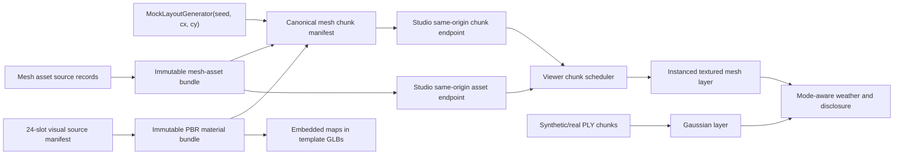

# Infinite textured mesh chunks

Date: 2026-07-18
Status: user-approved design

## 1. Decision summary

The arbitrary-coordinate synthetic world will gain a separate, streamed mesh
representation generated from the same deterministic `MockLayoutGenerator`
inputs as the current PLY world. The representation will not ship a complete
standalone GLB for every 200 m chunk. Instead it will use:

1. an immutable, content-addressed mesh-asset bundle containing the eleven
   replaceable building, vegetation, and prop templates;
2. the existing immutable 24-slot derived PBR material bundle;
3. a small, canonical chunk manifest containing verified bundle identities,
   terrain/road/water geometry, and template instance transforms;
4. Viewer-side instancing, LOD, LRU disposal, and same-origin loading through
   the existing arbitrary-coordinate scheduler.

The existing Gaussian PLY route remains the synthetic splat representation.
Real reconstruction `chunks.json` remains a third, evidence-gated path.
Synthetic mesh, synthetic splats, and real 3DGS are distinct renderer
capabilities and never upgrade one another's provenance.

## 2. Why this is the next high-value slice

Two individually working experiences are currently separated:

- the on-demand PLY world supports negative and arbitrary chunk coordinates,
  distance LOD, real registered synthetic splat assets, and six weather states;
- the finite canary GLB has embedded synthetic-derived PBR maps, audited UVs
  and tangents, improved four-sided buildings, and true mesh relighting.

They cannot be overlaid honestly as-is. The finite canary uses a different
scene recipe and terrain relief reaching roughly 120 m, while the on-demand
world's current terrain is nearly flat and its registered assets are Gaussian
PLY payloads. A coordinate declaration alone would not remove that visible
terrain and layout seam.

Streaming the finite 133 MB GLB per chunk would also duplicate textures and
geometry, produce unacceptable network and GPU growth, and make one asset
replacement invalidate every chunk payload. Shared immutable templates plus
small instance manifests preserve the existing replacement semantics and make
arbitrary-coordinate textured roaming practical.

## 3. Goals

1. Show textured mesh terrain, roads, water, buildings, vegetation, and props
   at arbitrary positive and negative chunk coordinates.
2. Use `MockLayoutGenerator(world_seed).generate_chunk(cx, cy)` as the single
   layout source for both the PLY and mesh representations.
3. Preserve exact world-space placement:
   `world_x = cx * 200 + local_x`,
   `world_y = cy * 200 + local_y`, and Z-up metre-scale synthetic coordinates.
4. Make every mesh template and material map independently replaceable through
   content-addressed bundle revisions.
5. Reuse the existing Viewer chunk scheduler's distance selection, bounded
   concurrency, LRU eviction, negative coordinates, and same-origin policy.
6. Keep all renderer and provenance labels machine-verifiable and fail closed
   on missing, malformed, redirected, or hash-mismatched dependencies.
7. Keep weather changes reversible and mode-aware: mesh materials relight;
   Gaussian content receives atmospheric overlays only.
8. Establish a contract that can later host better authored templates without
   changing chunk coordinates or the Viewer protocol.

## 4. Non-goals and honest limitations

- The synthetic mesh world is not a real reconstruction and remains
  `preview-only`.
- Synthetic-derived PBR maps are not calibrated scans or real photo textures.
- The first mesh template bundle does not convert Gaussian PLY payloads into
  watertight or UV-unwrapped meshes. It is a parallel, explicitly identified
  representation of the same replaceable asset IDs.
- This work does not align the finite canary scene with the infinite world.
- It does not silently mix synthetic mesh with real 3DGS. A real pocket needs
  a measured, content-addressed frame transform and compatible units.
- The initial terrain recipe matches the current nearly flat on-demand world;
  it does not claim the 120 m relief of the finite canary.
- It does not add gameplay-grade collision, physics, snow accumulation,
  deforming foliage, or physically simulated rainfall.
- It does not make a macOS Blender build authoritative. The existing locked
  Windows x64 canary contract remains the authoritative publication path.

## 5. Rejected alternatives

### 5.1 Overlay the finite canary on the PLY world

The scene recipes and height ranges differ materially, so the join would be a
visible false alignment. This can become a deliberate portal or measured scene
pocket later, but it is not an infinite-world foundation.

### 5.2 Return a self-contained textured GLB for every chunk

It would duplicate the same eleven templates and 24 material map sets across
every response. Cache invalidation, bandwidth, GPU memory, and replacement
costs would scale with world area rather than asset revisions.

### 5.3 Convert registered Gaussian PLY assets to meshes at request time

The PLY payloads contain splat vertices, colour coefficients, opacity, scale,
and rotation, not a proven surface topology or UV parameterisation. Automatic
surface reconstruction would be slow, unstable, and would invent geometry that
the registry never asserted.

### 5.4 Generate all detailed geometry directly in the browser

This avoids template downloads but forks the verified Blender material and
geometry path into JavaScript, weakens replacement auditing, and makes template
quality upgrades harder. Browser code may construct chunk-local terrain strips
and simple road/water meshes, but replaceable objects come from verified
template GLBs.

## 6. Architecture

The chunk manifest is the variable world payload. Template GLBs are immutable
and heavily cached. Material maps are embedded in the templates so a template
is portable and the Viewer cannot bind a different material revision by
filename. The template bundle manifest records the material bundle identity
used to build every GLB.

## 7. Mesh-asset bundle contract

The new `MeshAssetBundle` is an absent-only published directory keyed by the
SHA-256 of its canonical manifest. It contains exactly one record for each
current replaceable asset ID:

- buildings: `house_wood_01`, `house_wood_02`, `house_stone_01`,
  `house_thatch_01`, `house_barn_01`;
- vegetation: `tree_pine_01`, `tree_broadleaf_01`, `tree_bamboo_01`;
- props: `stone_wall_01`, `stone_lamp_01`, `fence_wood_01`.

Every record contains:

- `asset_id`, `kind`, and mesh algorithm ID;
- source contract identity and intended footprint;
- `lod` records with exact GLB SHA-256, byte count, primitive count, triangle
  count, material slot IDs, and local AABB;
- bound `material_bundle_id` and material bundle manifest SHA-256;
- `synthetic=true`, `geometry_usability=preview-only`,
  `real_photo_textures=false`;
- build tool identity and verification level.

Publication requires an independent GLB audit for every LOD. An absent,
duplicate, redirected, externally referenced, corrupt, or hash-mismatched
template fails closed. No placeholder box is substituted after the manifest
has promised a verified template.

The first complete bundle provides all eleven assets at near and far LODs.
Higher-quality source replacement creates a new asset revision and bundle
identity without changing `asset_id`.

## 8. Canonical chunk manifest

The endpoint is versioned separately from the PLY route:

`GET /api/world/mesh-chunk/{x}/{y}.json?lod={0|1|2}`

`HEAD`, strong `ETag`, and `If-None-Match`/`304` are required. Coordinates are
signed integers and use the same configured world bounds as the PLY endpoint.

The canonical, path-independent payload contains:

- schema and renderer capability IDs;
- `world_seed`, signed `chunk_x`, signed `chunk_y`, `chunk_size_m=200`;
- exact `world_offset` and three-dimensional AABB;
- `layout_algorithm_id` and hash of canonical layout input;
- mesh asset bundle ID and material bundle ID;
- selected LOD and deterministic terrain recipe ID;
- terrain grid, road ribbons, and water ribbons in chunk-local coordinates;
- sorted object instances with stable instance ID, `asset_id`, local position,
  Z rotation, scale, and selected template LOD;
- explicit synthetic/provenance disclosure fields.

Runtime asset URLs are projected by the Studio server from verified bundle
records and are not content identity. They must remain same-origin and point to
the exact content-addressed asset route.

The response cache key includes the seed, signed coordinates, requested LOD,
layout algorithm ID, terrain algorithm ID, mesh asset bundle ID, and material
bundle ID. Any source or algorithm replacement therefore changes the ETag.

## 9. Terrain, roads, and water

The current layout names a heightmap that is not produced by the on-demand
kernel. The mesh contract must not imply that those nonexistent bytes were
consumed.

The first terrain implementation therefore declares
`terrain_algorithm_id=mock-flat-ground-v1` and generates a deterministic grid
whose height envelope matches the current PLY ground layer. Adjacent chunks use
identical shared-edge samples. Terrain UVs are world anchored so textures do
not restart at chunk boundaries.

Road and water ribbons are derived directly from the layout polylines. Their
vertices are clipped to the chunk footprint, use small documented Z offsets,
and receive stable world-anchored UVs. This provides semantic continuity
without claiming a missing heightmap.

A later terrain revision can add relief only by changing the terrain algorithm
ID and updating both mesh and PLY recipes together. It may not silently reuse
the current identity.

## 10. Viewer scheduling and rendering

The Viewer adds a `synthetic-mesh-grid` capability alongside the existing
Gaussian grid capability. Both use the same camera-to-chunk calculation, but
their payloads and trust labels remain distinct.

For mesh chunks the Viewer:

1. validates the manifest before loading any dependency;
2. resolves template URLs only through the verified same-origin bundle route;
3. caches each immutable template LOD once;
4. creates instanced meshes for repeated assets;
5. creates chunk-local terrain, road, and water buffers;
6. translates the chunk root by the exact world offset;
7. selects chunk/template LOD by camera distance with hysteresis;
8. evicts chunk instances and disposes unreferenced GPU resources through the
   existing LRU budget;
9. reports loaded, pending, failed, and evicted mesh chunks independently from
   Gaussian chunks.

The initial presentation selector offers `Textured mesh`, `Gaussian splats`,
and, only when measured evidence allows it, `Aligned mixed`. It never calls
synthetic mesh a reconstructed model.

## 11. Weather behavior

The existing six weather states remain the single environment state machine.

- Textured mesh mode changes actual lights, fog, exposure, sky/background, and
  reversible Viewer-owned material clones.
- Synthetic and real Gaussian modes use fog, particles, sky/background, and
  exposure overlays; `splat_relighting=false` remains visible in capability
  evidence.
- Returning to `clear` restores exact base mesh material values.

No weather transition changes geometry provenance, coordinate confidence,
template identity, or material bundle identity.

## 12. Provenance and failure policy

The mesh grid may be displayed only when all of these are verified:

- allowed renderer schema and exact algorithm IDs;
- signed integer coordinates within configured bounds;
- canonical layout hash;
- verified mesh and material bundle manifests;
- exact asset payload hash and byte count;
- compatible coordinate convention and chunk size;
- same-origin URLs;
- supported Viewer capability.

Unknown or contradictory fields make the mesh chunk unavailable. The Viewer
may continue showing already verified Gaussian content, but it must display the
mesh failure and must not downgrade to unverified boxes or flat colours.

Synthetic mesh manifests always declare:

- `synthetic=true`;
- `geometry_usability=preview-only`;
- `coordinate_confidence=synthetic-layout`;
- `metric_alignment=false`;
- `real_photo_textures=false`;
- `renderer_capability=synthetic-textured-mesh-grid`.

## 13. Delivery slices

### Slice A: contract and one real route

- canonical mesh bundle and chunk models;
- content keys, validators, signed-coordinate endpoint, ETag/HEAD/304;
- one hermetic audited template fixture;
- focused server tests proving fail-closed behavior.

This is a protocol slice, not a visual-completion claim.

### Slice B: complete replaceable template bundle

- all eleven near/far template assets;
- embedded PBR maps from the existing material bundle;
- independent GLB structure, AABB, triangle, material, UV, tangent, and hash
  audit;
- replacement proof that one source changes bundle and response identities.

### Slice C: Viewer streaming

- manifest validation and same-origin template resolution;
- instancing, terrain/road/water geometry, LOD hysteresis, LRU disposal;
- textured mesh presentation mode and truthful status;
- positive and negative coordinate browser tests.

### Slice D: weather and acceptance

- all six weather states with exact clear restoration;
- long-distance arbitrary-coordinate jumps;
- bounded memory/network behavior;
- asset replacement and failure demonstrations;
- screenshot and machine-verifiable acceptance receipt.

## 14. Acceptance

The feature is accepted only when:

1. browser navigation reaches positive and negative coordinates outside the
   baked extent and receives textured mesh chunks without a terrain seam;
2. every displayed replaceable object comes from a hash-verified mesh template;
3. all eleven current asset IDs are represented at two or more LODs;
4. templates use the verified 24-slot material bundle with embedded maps,
   audited UVs/tangents, and no external GLB resources;
5. repeated assets are instanced and template bytes are fetched once per LOD;
6. distance LOD and LRU keep configured network and GPU budgets bounded;
7. all six weather states are visibly distinct and `clear` restores exact mesh
   material state;
8. changing one template or material source changes all affected content
   identities without changing world coordinates;
9. malformed identities, hashes, coordinates, URLs, layouts, or bundles fail
   closed with a visible error;
10. synthetic mesh, synthetic splats, and real 3DGS remain separately labeled;
11. focused Python/Node tests, full pytest, Viewer/Studio tests, Ruff, compile,
    and browser runtime checks pass.

Passing these gates proves arbitrary-coordinate textured synthetic roaming. It
does not prove real-world reconstruction quality, metric alignment, or
physically accurate weather.
