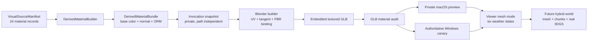

# Synthetic PBR material consumption and textured preview

Date: 2026-07-18  
Status: user-approved design; written specification awaiting user review

## 1. Decision summary

The synthetic-village pipeline will consume the existing 24 content-addressed
material visual sources instead of creating a second texture registry. A new
immutable `DerivedMaterialBundle` converts each verified source into embedded
base-color, tangent-space normal, and occlusion/roughness/metallic maps. The
Blender builder receives only path-independent material records plus a private
invocation snapshot, creates deterministic UVs and tangents, binds the maps, and
exports a GLB whose texture structure is audited before publication.

The first visible delivery is a private, explicitly non-authoritative macOS
preview so the current machine can verify appearance without weakening the
Windows x64 canary contract. A later authoritative build must still use the
locked Blender 4.5.11 Windows x64 runtime and its existing fail-closed gates.

This is the material subsystem of the larger 360-degree, arbitrary-coordinate,
multi-weather experience. It does not redefine that larger goal as complete.
The final composition remains:

- textured synthetic mesh for replaceable architecture, terrain, props, and
  dynamic mesh relighting;
- chunked/on-demand content for arbitrary-coordinate roaming;
- aligned real 3DGS pockets where real capture and cloud training exist;
- atmospheric overlays for 3DGS, whose baked appearance cannot be truthfully
  relit by this Viewer.

## 2. Current evidence

The current tracked preview is intentionally coarse:

- `village-canary.glb` has 539 meshes, 542 primitives, and 24 materials;
- it has no images, textures, samplers, `TEXCOORD_0`, or vertex colors;
- every material uses only constant `baseColorFactor`, roughness, and metallic
  values;
- the Viewer manifest declares
  `simplified-pbr-not-render-parity` and `no-photo-textures`.

The missing appearance is not a loader failure. The existing Blender builder
never consumes image payloads.

The private visual-source pack already contains all 24 material slots. Every
record has a stable slot ID, content-addressed object path, SHA-256, dimensions,
complete prompt, generator interface, source manifest identity, and
`synthetic=true`. The tracked slot catalog already defines the replacement
contract:

> Replace the slot through a new content-addressed visual-source revision;
> consumers depend on the slot contract, never on exact pixels.

The source images are photorealistic synthetic material studies. They are not
real capture, are not proven physically calibrated scans, and are not guaranteed
to be seamless PBR map sets. The pipeline must derive and describe what it
actually uses.

## 3. Goals

1. Consume all 24 existing material source records without copying private
   payloads into Git.
2. Produce a versioned, immutable, content-addressed material bundle with
   base-color, tangent-space normal, and ORM maps for every slot.
3. Give every rendered mesh primitive a deterministic `TEXCOORD_0` mapping and
   every normal-mapped primitive a tangent basis.
4. Export an embedded GLB that visibly distinguishes roof tile, rammed earth,
   lime plaster, fieldstone, weathered timber, soil, vegetation, water, and
   metal at useful inspection distances.
5. Preserve independent replacement of each slot. Replacing one source creates
   new derived bytes, manifest digest, build ID, and preview identity.
6. Let the six Viewer weather states produce visibly distinct lighting and
   surface response in textured mesh mode while keeping 3DGS weather labeled as
   an atmospheric overlay.
7. Provide a private macOS preview path for rapid visual review without
   presenting it as the authoritative Windows canary.
8. Make texture presence, UV coverage, map binding, provenance, and Viewer
   capability machine-verifiable.

## 4. Non-goals and honest limitations

- This slice does not turn synthetic generated images into real photo textures.
- It does not infer calibrated displacement, reflectance, or metric material
  scale from one RGB image.
- It does not add a CUDA trainer or relight Gaussian splats.
- It does not make the finite canary mesh itself an infinite world.
- It does not replace the on-demand chunk protocol or the real reconstruction
  path.
- It does not claim snow accumulation, puddle simulation, deforming vegetation,
  or physically simulated rainfall.
- It does not overwrite the current tracked release with a macOS local build.
- It does not permit a missing or invalid texture to fall back silently to the
  existing flat-color material.

The generated maps improve visual frequency, material identity, and lighting
response. Repetition, mirrored tiling, simplified geometry, and source-image
bias can remain visible. The Viewer must retain a concise synthetic-preview
disclosure.

## 5. Rejected alternatives

### 5.1 Viewer-only procedural noise

Adding noise in Three.js is fast, but it cannot provide independently
replaceable material sources, a portable GLB, or inspectable PBR provenance. It
also preserves the current artificial appearance. This remains unsuitable as
the main path.

### 5.2 A second public texture registry

The existing `VisualSourceManifest` and 24 stable slots already provide source
identity and replacement semantics. A parallel registry would create two
authorities and ambiguous replacement behavior. The derived bundle is a
revision owned by the source manifest, not a competing source registry.

### 5.3 Passing private absolute paths in the canonical build request

Absolute paths would leak machine identity and make identical bytes produce
different build identities. The approved design keeps canonical requests
path-independent and passes an ephemeral private directory only as a runtime
transport.

## 6. Architecture



The implementation has six bounded units:

1. `DerivedMaterialBuilder` validates sources and generates deterministic maps.
2. `DerivedMaterialBundle` records all input, output, tool, and parameter
   identities.
3. `MaterialInvocationSnapshot` copies the exact required objects into a
   one-run private directory and verifies them before and after Blender.
4. `BlenderMaterialBinder` creates UVs, tangents, image nodes, and material
   extras.
5. `GlbMaterialAudit` verifies the exported container rather than trusting
   Blender scene state.
6. `TexturedPreviewProjection` exposes a verified local preview to the same
   origin Viewer without publishing it as a release.

Each unit communicates with a versioned canonical manifest. No unit infers trust
from a filename, Blender material name, or engine label.

## 7. DerivedMaterialBundle contract

### 7.1 Private layout

Derived data stays below the ignored runtime root:

```text
.nantai-studio/synthetic-village/hybrid-v3/
  material-bundles/
    <bundle-id>/
      manifest.json
      objects/
        <sha256>.png
  work/
    material-bundle-<nonce>/
    canary/
      .invocation-<nonce>/
        material-inputs/
```

Publication is absent-only. Work directories are never consumed as committed
bundles. A complete bundle is immutable after publication.

### 7.2 Manifest identity

`DerivedMaterialBundle` schema v1 contains:

- `schema_version`;
- `bundle_id`, equal to the SHA-256 of canonical manifest content excluding the
  ID field;
- `synthetic=true`;
- source visual-manifest SHA-256 and source pack ID;
- derivation tool identity: repository module SHA-256, Python version, Pillow
  version, algorithm ID, and fixed parameters;
- exactly 24 records sorted by `slot_id`.

Each material record contains:

- `slot_id`;
- source image SHA-256, dimensions, and synthetic provenance;
- base-color, normal, and ORM object descriptors;
- each object path, SHA-256, byte length, dimensions, PNG media type, and color
  space;
- UV policy ID and nominal metres-per-tile used only as an artistic scale;
- material defaults such as normal strength, roughness centre, and metallic
  value;
- the source replacement-contract digest.

An object path is portable and derived from its digest:
`objects/<sha256>.png`. Duplicate byte-identical maps may share one object.

### 7.3 Deterministic map derivation

The v1 algorithm is fixed and versioned:

1. Decode the verified source, apply its declared orientation, convert to
   8-bit sRGB RGB, and fail on unsupported or changing input.
2. Take the largest centred square crop and resize to `1024 × 1024` with the
   explicitly recorded resampler.
3. Form a `2 × 2` mirrored mosaic and take its centred `1024 × 1024` region.
   Opposite borders therefore contain equal pixels and repeat without a hard
   edge. The mirroring limitation remains disclosed.
4. Save the result as the base-color PNG with fixed encoder parameters and no
   nondeterministic metadata.
5. Convert RGB to integer luminance using one fixed coefficient formula.
6. Compute a wrapped 3×3 Sobel gradient, apply the slot's fixed normal
   strength, normalize with a defined rounding rule, and encode an OpenGL
   tangent-space normal PNG.
7. Compute the ORM PNG with:
   - red: bounded local occlusion estimate from wrapped luminance contrast;
   - green: slot roughness centre plus bounded high-frequency variation;
   - blue: the slot metallic value.

All arithmetic rules and per-slot parameters belong to the algorithm version
and therefore to the bundle identity. A later seam algorithm, resolution, map
formula, or material parameter creates a new algorithm ID and bundle.

The builder compares bytes and hashes, not only decoded pixels. A library
version that produces different PNG bytes creates a different bundle identity;
it is never silently accepted as the same output.

## 8. Canonical build request and runtime transport

The authoritative Blender request becomes schema v2. It adds:

- `material_bundle_manifest_sha256`;
- a sorted `material_input_registry` with exactly 24 records;
- per record: slot ID, the three map digests, dimensions, color-space
  declarations, UV policy, artistic scale, and synthetic provenance.

Schema v2 also makes the visual-slot claim match actual consumption:

- a sourced material uses `usage_mode=runtime-material-source-v1`;
- its implementation is `derived-pbr-material-v1`;
- `build_status=instantiated` is allowed only when the material input registry
  references all three verified maps and the exported GLB audit proves the
  binding.

Legacy schema v1 keeps its original `design-reference-only` and
`pbr-material-v1` meanings for the flat canary. Those values are never
reinterpreted in place as proof that image bytes were consumed.

The request contains no local source or bundle path. Its `build_id` includes the
complete material registry and bundle-manifest digest.

Before Blender starts, the canary runner:

1. verifies the source manifest and committed derived bundle;
2. snapshots every required regular file;
3. copies the exact content-addressed objects into
   `<invocation-root>/material-inputs/`;
4. durably flushes and re-hashes the snapshot;
5. invokes Blender with a fixed `--materials <invocation path>` argument;
6. re-verifies request and material snapshots after Blender exits.

The ephemeral argument is transport, not identity. The builder derives expected
filenames from request digests, rejects symlinks, junctions, unexpected files,
missing files, wrong sizes, wrong dimensions, wrong image modes, and hash
mismatches. It verifies each file immediately before loading and again after
scene export.

Clean-checkout tests generate small private fixture images and manifests under
`tmp_path`. They never depend on the developer's ignored `.nantai-studio`
payload.

## 9. UV and tangent contract

Every visible mesh primitive exported by the textured canary has
`TEXCOORD_0`. UVs use world-space dimensions before glTF axis conversion so
object scale does not accidentally change texture density.

The v1 projection policies are:

- `world-xy`: terrain, soil, paths, water, crops, and horizontal surfaces;
- `dominant-axis-box`: plaster, rammed earth, stone, masonry, and generic
  architectural solids;
- `roof-slope`: roof faces, with the long texture direction aligned to the roof
  fall direction;
- `object-long-axis`: timber, bamboo, fences, and elongated props;
- `leaf-card`: leaf and foliage surfaces with stable local orientation.

Projection policy and nominal tile scale come from the material record, not
from object or file names. Polygon-loop UVs permit face seams without splitting
semantic object identity. Negative UV coordinates are valid.

After UV creation, Blender computes tangents from the final triangulated mesh.
Every primitive bound to a normal texture must export `TANGENT`. A primitive
without a normal texture may omit it only if the material registry explicitly
declares that exception; schema v1 declares no such exceptions.

The process may duplicate render vertices at UV seams, but it must not change
canonical object IDs, instance IDs, world transforms, semantic IDs, material
IDs, source bounds, or geometry-usability claims.

## 10. Blender material binding and GLB export

Every one of the 24 Blender materials receives:

- a base-color image texture interpreted as sRGB;
- a normal image texture interpreted as non-color through a Normal Map node;
- an ORM image interpreted as non-color;
- Principled BSDF roughness and metallic channels driven from ORM;
- stable extras for slot ID, source SHA-256, derived-bundle ID, algorithm ID,
  synthetic provenance, and UV policy.

The GLB remains self-contained. Images are embedded as buffer views; there are
no external URIs, data URLs, remote URLs, or absolute paths.

The exporter must preserve the existing cameras, lights, object extras, stable
IDs, coordinate conversion, and artifact hash reporting. Texturing changes the
build identity but does not raise `geometry_usability` above `preview-only`.

## 11. Post-export GLB audit

Publication depends on an independent parser of the GLB JSON and binary chunks.
The audit requires:

- valid GLB header, declared lengths, JSON chunk, and buffer views;
- exactly 24 expected material slot identities;
- an embedded base-color, normal, and metallic-roughness texture for every
  material;
- embedded image buffer views with declared PNG media type;
- no external image or buffer URI;
- every mesh primitive has a material and `TEXCOORD_0`;
- every normal-mapped primitive has `TANGENT`;
- every accessor and buffer view stays within the binary chunk;
- all material extras match the build request;
- the audited GLB SHA-256 matches the build report artifact record.

The report records actual mesh, primitive, material, image, texture, UV, and
tangent counts. A Blender scene that looks correct but exports an incomplete
GLB fails.

## 12. Viewer presentation and weather

### 12.1 Mode-specific truth

The model-preview manifest advances to an additive schema that distinguishes:

- `material_fidelity: synthetic-derived-pbr`;
- `synthetic_pbr_textures: true`;
- `real_photo_textures: false`;
- `dynamic_mesh_relighting: true`;
- `splat_relighting: false`;
- `geometry_usability: preview-only`.

The visible badge says that the mesh uses synthetic derived PBR textures and is
not a real photographed or measured reconstruction. The old
`no-photo-textures` limitation is replaced only for the new schema by a precise
`no-real-photo-textures` limitation. Legacy schema v1 validation remains
unchanged for the current tracked release.

### 12.2 Six weather states

In textured mesh mode, the existing six states control actual Three.js lights,
fog, exposure, background, and reversible material response:

- `clear`: neutral daylight and original material factors;
- `overcast`: soft cool light, lower direct contrast, denser ambient fill;
- `rain`: cool dim light, rain overlay, darker base-color factor, and lower
  roughness multiplier to suggest wetness;
- `snow`: cool bright environment, snow overlay, higher diffuse fill, and a
  restrained cool surface tint;
- `fog`: reduced visibility, low directional contrast, and dense depth fog;
- `night`: low exposure, cool ambient light, and limited warm directional fill.

Runtime changes operate on Viewer-owned material clones and are fully reversible
to immutable source values. They do not mutate manifest provenance or GLB
bytes.

For 3DGS, the same control remains an atmospheric overlay and never claims
relighting. The UI label and status are selected by active renderer capability:
`mesh relighting + atmosphere` versus `3DGS atmosphere only`.

The three content-addressed Blender lighting profiles remain separate build
variants for offline comparison. Their digests are not replaced by the six
interactive Viewer states.

## 13. Private macOS preview and authoritative release

The locked canary request continues to require Blender 4.5.11 Windows x64. The
macOS build does not relax or impersonate that contract.

A separate `LocalTexturedPreviewRequest` and command:

- records the actual macOS Blender executable digest, version, platform, and
  runtime output;
- uses the same material bundle, UV algorithm, builder logic, and GLB audit;
- emits `authoritative=false`, `verification_level=L0`, and
  `local-preview-only`;
- publishes below a private preview root by absent-only identity;
- can be served by `studio_server.py` through a fixed same-origin route that
  accepts only an opaque preview ID, never a filesystem path.

Viewer may load that manifest only in localhost Studio preview mode. It shows a
local-preview badge and cannot update the tracked release projection or an
active SceneRevision.

The local request is a different schema and code path from the authoritative
canary request. It cannot be passed to the authoritative publisher, and the
Windows identity check remains exact rather than becoming a permissive platform
enum.

The authoritative Windows result uses its own build ID and release manifest.
Mac and Windows hashes are compared and reported; equality is evidence, not an
assumption or a promotion rule.

## 14. Failure and recovery behavior

The following conditions fail before publication:

- fewer or more than 24 material records;
- missing slot, duplicate slot, unknown slot, or replacement-contract mismatch;
- source or derived object hash mismatch;
- changing file, redirected path, unsupported image, invalid dimensions, or
  decode failure;
- partial derived bundle or existing destination with different bytes;
- unknown derivation algorithm or unrecorded parameter;
- incomplete invocation snapshot;
- Blender material without a verified source;
- missing UV, tangent, texture binding, or embedded image in the exported GLB;
- path, username, or private root leaked into a canonical manifest;
- model-preview manifest that overstates texture origin or renderer capability.

There is no flat-color fallback in a textured build. Failures retain the current
working preview, clean owned transient directories, and place conflicting
partial results in the existing private quarantine pattern when evidence is
needed. Recovery verifies exact intent and content identity; it never chooses
the newest-looking directory or filename.

## 15. Test strategy

### 15.1 Pure Python

- canonical bundle manifest and bundle ID;
- exact 24-slot coverage and sorted order;
- independent slot replacement changes the expected identities;
- deterministic map derivation from fixed tiny fixtures;
- seamless opposite edges for the mirrored base-color map;
- normal-vector encoding and bounded ORM channels;
- corrupt, changing, oversized, redirected, and wrong-hash inputs fail closed;
- absent-only publication, interrupted publication, and recovery;
- invocation snapshot contains only declared content-addressed objects;
- clean checkout uses generated fixtures rather than private payload.

### 15.2 Blender source and runtime

- schema v2 rejects missing or altered material records;
- builder consumes the runtime material directory and verifies every digest;
- each material has the expected node graph and extras;
- every visible mesh receives the declared UV policy;
- tangents exist after final triangulation;
- existing object, semantic, camera, bounds, and geometry checks remain green;
- official Windows runtime build produces all requested artifacts.

### 15.3 GLB audit

- positive fixture with embedded base-color, normal, and ORM maps;
- missing `TEXCOORD_0`, `TANGENT`, texture, material, image buffer view, or
  extras fails;
- external URI, buffer overrun, duplicate material slot, or mismatched GLB hash
  fails;
- the real built GLB passes and its reported counts match parsed bytes.

### 15.4 Viewer

- legacy flat preview remains valid and honestly disclosed;
- new textured-preview schema requires all mode-specific capability fields;
- new manifest rejects `real_photo_textures=true`;
- local preview route rejects traversal, arbitrary paths, wrong IDs, hashes,
  origins, and missing bundles;
- six weather states alter mesh lighting/material clones and restore exact base
  values;
- 3DGS mode continues to say atmosphere only;
- environment state never mutates reconstruction provenance.

### 15.5 Visual acceptance

Browser acceptance uses fixed close, middle, and overview cameras:

- roof tiles show repeated tile structure without a hard wrap seam;
- rammed earth shows layered aggregate rather than a flat ochre color;
- plaster, fieldstone, and timber are visually distinguishable at close range;
- normal response changes as the camera or light moves;
- rain visibly darkens and wets mesh materials, and returning to clear restores
  the original appearance;
- no material renders magenta, black from a missing map, or stretched across an
  obviously wrong projection axis;
- the disclosure is visible but does not obstruct 360-degree inspection.

Screenshots and the tested manifest/build IDs are recorded in a verification
receipt. Visual judgment supplements, but never replaces, structural GLB
auditing.

## 16. Acceptance gates

The material subsystem is accepted only when all of the following are true:

1. A committed bundle contains exactly 24 verified material records and three
   derived maps per slot.
2. The built GLB has 24 expected textured materials and no external resources.
3. One hundred percent of visible primitives have `TEXCOORD_0` and a material.
4. One hundred percent of normal-mapped primitives have `TANGENT`.
5. The GLB audit, Python tests, Viewer tests, Ruff, and compile checks pass.
6. A macOS local preview is visibly better at the fixed close-range cameras and
   is labeled non-authoritative.
7. An authoritative Windows canary passes before any tracked release is
   replaced.
8. Source replacement creates a new material bundle, build ID, GLB hash, and
   preview manifest while preserving the slot contract.
9. The six Viewer weather states are visibly distinct in mesh mode and the
   3DGS path remains honestly overlay-only.

Passing these gates proves the textured synthetic model slice. It does not by
itself prove arbitrary-coordinate textured roaming, real 3DGS reconstruction,
or completion of the overall product goal.

## 17. Continuation toward the full product goal

After this subsystem is accepted:

1. apply the same immutable material-bundle identity to textured synthetic
   world chunks rather than only the finite canary GLB;
2. stream mesh LOD by the existing coordinate/chunk scheduler while preserving
   negative coordinates and same-origin fetch rules;
3. add walk/fly navigation and collision/grounding on top of the already
   available orbit inspection;
4. keep real reconstruction `chunks.json` separate from procedural
   continuation and align real 3DGS pockets through measured transforms only;
5. run end-to-end browser acceptance for 360-degree view, arbitrary coordinate
   jumps, streamed LOD, all weather states, asset replacement, and mixed
   mesh/3DGS disclosure.

This order makes material realism reusable instead of baking it into a single
demo, while preserving the provenance boundary required by the project.
