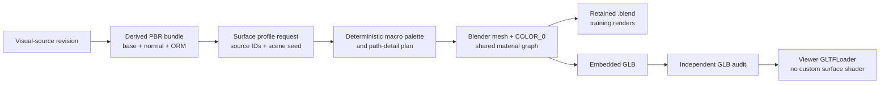

# Source-consistent multiscale surface realism

Date: 2026-07-19  
Status: user approved Scheme A; written-spec review pending  
Scope: finite synthetic-village Blender source, training renders, exported GLB,
and local Viewer preview

## 1. Decision

Introduce an explicit surface profile:

```text
source-consistent-multiscale-surface-v1
```

The profile keeps the exact verified 1024 × 1024 base-color, normal, and ORM
maps as the high-frequency detail layer. It adds three source-bound layers:

1. low-frequency world-space colour modulation stored as standard glTF
   `COLOR_0`;
2. moderately denser terrain and path geometry so metre-scale variation can be
   sampled without changing the coordinate frame;
3. deterministic path details: shallow ruts, stone fragments, leaf litter, and
   damp-toned soil patches.

Blender training renders and the exported Viewer GLB are built from the same
scene, mesh, material bundle, profile, vertex colours, and detail placements.
There is no Viewer-only noise shader and no unrelated macro texture.

This is a synthetic appearance upgrade. It remains:

```text
synthetic=true
material_fidelity=synthetic-derived-pbr
real_photo_textures=false
geometry_usability=preview-only
```

It does not promote the scene to measured, metric-aligned, real-photo, or real
reconstruction truth.

## 2. Current measured boundary

The newest retained local textured build measured:

- `83,494` indexed GLB triangles;
- `559` GLB primitives;
- `134,391,072` GLB bytes;
- zero `COLOR_0` attributes;
- a `700 × 500 m` terrain sampled on a `5 m` grid, or `28,000` triangles;
- six packed-earth paths totalling `1,452.203 m`;
- only 39 source path quads before Blender triangulation;
- individual source path segments as long as `74.383 m`;
- one `3 m` packed-earth tile repeated approximately 484 times along the
  combined path length.

The packed-earth v2 source pilot proved that the map derivation is not the main
loss boundary:

- source-to-derived SSIM: `0.94878`;
- mean RGB absolute error: `2.126`;
- interior mean absolute error: `0.0`;
- edge-band mean absolute error: `4.859`.

In the fixed production-camera path mask, however, the cleaner source reduced
Laplacian variance from `2162.908` to `618.954` and mean gradient from `36.991`
to `18.894`. It removed false swirl/banding, but the scene still lacked
metre-scale structure and source-compatible local detail. More texture
resolution alone will not solve that.

The Viewer already applies up to 8× anisotropic filtering. This design does not
duplicate that work.

## 3. Goals

1. Preserve the exact source-revision and derived-material identities already
   consumed by Blender.
2. Break obvious 3 m repetition without replacing the source appearance.
3. Make packed earth, terrain, fields, and courtyards retain readable variation
   from a `1.6 m` pedestrian camera.
4. Keep Blender training images and Viewer appearance spatially consistent.
5. Preserve all object IDs, coordinate transforms, camera matrices, material
   slot IDs, and replacement contracts.
6. Keep the complete finite preview within measured geometry, draw-call, and
   byte budgets.
7. Make the new appearance structurally auditable from the exported GLB.
8. Leave a deterministic world-coordinate algorithm that can later be ported
   to the separate on-demand chunk producer without seams.

## 4. Non-goals and honest limitations

- This slice does not add real photographs or calibrated material scans.
- It does not infer physical displacement or reflectance from one RGB source.
- It does not make simplified roofs, trees, or props photorealistic.
- It does not add enterable interiors or collision for the new small details.
- It does not simulate mud, water flow, leaf motion, tyre traffic, or soil
  deformation.
- Damp-toned patches are static source-compatible colour/geometry details, not
  a physical wetness claim.
- It does not rewrite the separate infinite-world terrain/chunk schema in this
  slice. That path already has its own deterministic macro-tint contract and
  must receive a separately versioned port of this algorithm.
- It does not promote a macOS L0 artifact to the locked Windows x64 L2 release.
- It does not change real 3DGS colour or relight splats.

## 5. Considered approaches

### 5.1 Approved: PBR detail + `COLOR_0` macro layer + geometry detail

This is Scheme A. It keeps one verified PBR tile per material, adds compact
low-frequency colour in standard glTF, and uses geometry only where it adds a
readable silhouette or depth cue. It travels through Blender and GLB without a
custom Viewer shader.

### 5.2 Rejected: 2K/4K macro atlas

A large atlas could hide repetition in one finite scene, but it would add tens
or hundreds of megabytes, bind appearance to the current extent, and create a
new image authority. It would also be awkward to continue across arbitrary
chunk coordinates.

### 5.3 Rejected: Viewer-only stochastic shader

Runtime noise is cheap, but Blender training images would not contain the same
appearance. A 3DGS trained from Blender would therefore disagree with the
Viewer mesh, and the effect would not be present in the portable GLB.

### 5.4 Rejected: replace the source tile with procedural material

This would discard the approved visual-source revision and make replacement
semantics ambiguous. Procedural detail may supplement a verified source only
when its profile and parameters are explicit and content-addressed.

## 6. Architecture and ownership



The repository-side contract module owns:

- the profile ID and fixed parameters;
- canonical request/report models;
- source-bound macro-palette derivation;
- deterministic candidate hashing;
- budget calculations and pure validation.

The standalone Blender builder owns:

- terrain and path subdivision;
- path detail geometry;
- loop-domain colour attributes;
- material-node binding;
- measured build evidence.

The independent GLB audit owns:

- actual accessor types and counts;
- colour-value bounds;
- mesh, primitive, triangle, image, and byte evidence;
- agreement with the requested profile and material identities.

The Viewer owns no additional surface-generation logic. `GLTFLoader` consumes
the standard attributes emitted by Blender.

## 7. Identity and compatibility

### 7.1 Request field

New textured requests contain:

```json
{
  "surface_realism_profile_id": "source-consistent-multiscale-surface-v1"
}
```

The field participates in canonical request bytes and therefore changes the
preview/build identity.

Historical requests without the field remain the old profile:

```text
single-scale-derived-pbr-v0
```

Their canonical bytes and existing artifacts stay valid. The new profile is
never inferred from a material algorithm name, filename, Blender version, or
presence of a colour accessor.

### 7.2 Deterministic seed

Every stochastic-looking decision uses:

```text
sha256(
  profile_id + "\0" +
  decimal(scene_plan.seed) + "\0" +
  stable_object_id + "\0" +
  detail_class + "\0" +
  decimal(candidate_index)
)
```

Fixed digest bytes map to candidate acceptance, scale, rotation, and bounded
offsets. The implementation must not use Python `hash()`, Blender procedural
noise, ambient process state, wall-clock time, or unrecorded random seeds.

### 7.3 Report field

New build reports contain a strict `surface_realism` block:

- profile and algorithm IDs;
- scene seed;
- source visual-manifest SHA-256;
- derived material-bundle ID and algorithm ID;
- per-material macro-palette digest;
- terrain resolution and measured triangle count;
- per-path longitudinal and lateral sampling counts;
- detail counts by class and path root;
- minimum/maximum quantized colour components;
- coloured and constant-white primitive counts;
- builder-measured total triangles, mesh objects, and primitives.

The report describes the emitted scene. It does not promote trust.

## 8. Source-bound macro colour

### 8.1 Palette derivation

For each eligible material, the macro palette is derived only from that
record's verified base-colour PNG:

1. verify the descriptor and current bytes;
2. decode sRGB and convert to linear RGB;
3. resize to a fixed `16 × 16` low-pass sample grid with the recorded
   resampler;
4. compute the linear-RGB mean;
5. convert each sample into a per-channel multiplier relative to the mean;
6. clamp every multiplier to `[0.88, 1.10]`;
7. quantize each multiplier to a canonical `1/4096` fixed-point value;
8. hash the canonical 256-entry palette and record its digest.

This creates large-scale colour variation from the same source revision. It
cannot introduce a colour sampled from an unrelated photograph or generator.
The PBR base-colour texture remains the visible detail layer and is multiplied
by the interpolated macro colour.

Water, transparent materials, foliage, roofs, walls, and props use constant
white in v1. The active macro materials are:

```text
material-packed-earth-01
material-terrace-soil-01
material-moss-stone-01
material-wet-stone-paving-01
```

### 8.2 World-space sampling

Macro samples are evaluated in the existing metre-scale ENU world coordinates:

- terrain lattice period: `20 m`;
- path, field, and courtyard lattice period: `10 m`;
- interpolation: fixed cubic smoothstep value interpolation;
- lattice selection: SHA-256 of profile, material source SHA, scene seed, and
  integer world-lattice coordinates.

Object-local transforms and mesh tessellation therefore cannot move the colour
pattern. Adjacent faces sample the same function. Future chunks can reuse the
same absolute-coordinate evaluator without a boundary seam.

### 8.3 Blender and glTF representation

Every visible mesh receives a loop-domain `FLOAT_COLOR` attribute. Eligible
ground surfaces receive the sampled colour; all other surfaces receive
`(1, 1, 1, 1)`.

The Blender material graph multiplies:

```text
verified base-colour texture × linear vertex colour
```

before the Principled BSDF Base Color input. Normal and ORM bindings remain
unchanged.

The glTF exporter must emit `COLOR_0` as float component type `5126`, value
type `VEC4`. A normalized unsigned-byte accessor is deliberately insufficient:
it cannot represent multipliers above `1.0`. Viewer code must not patch
materials to recreate the pattern. If Blender does not export the declared
float accessor, the build fails.

## 9. Geometry sampling

### 9.1 Terrain

The finite terrain grid changes from `5 m` to `4 m` spacing:

- vertices: `176 × 126`;
- quads: `175 × 125`;
- exported triangles before material splitting: `43,750`;
- height function, bounds, material zoning, and world coordinates unchanged.

This adds 15,750 terrain triangles. It is dense enough to sample a 20 m macro
lattice at five intervals while staying inside the total budget. A 2 m or
denser grid is rejected for v1 because it would spend the budget on smooth
terrain without adding source detail.

### 9.2 Paths

The six source polylines and stable root IDs remain unchanged. Each path is
rebuilt as one continuous terrain-conforming ribbon:

- centreline longitudinal spacing: no more than `1.0 m`;
- six lateral rails across the `3.2 m` width;
- five strips and ten triangles per longitudinal interval;
- left/right positions and heights sampled from the existing terrain function;
- bounded miter join, with miter length no more than `1.5 ×` half-width;
- deterministic end caps;
- central walkable corridor remains at least `1.2 m` wide.

This replaces the current independent long quads, removes cracks at joins, and
provides lateral vertices for shallow rut relief and macro colour.

Ruts are bounded geometry offsets in accepted longitudinal runs:

- depth: `0.015..0.035 m`;
- run length: `6..18 m`;
- smooth entry/exit;
- never below the terrain surface by more than the declared depth;
- no change to path centreline identity or width.

Ruts are a synthetic visual cue, not measured vehicle evidence.

## 10. Deterministic path details

Details are generated from stable arc-length candidate cells and attached to
their existing path root. Geometry of each class is consolidated into one mesh
part per path, preventing one draw call per item.

| Class | Material source | Placement | Global cap |
|---|---|---|---:|
| stone fragments | `material-creek-rock-01` | outer path bands | 128 |
| leaf litter cards | `material-broadleaf-canopy-01` | outer path bands | 384 cards |
| damp-toned soil patches | `material-packed-earth-01` | outside central corridor | 72 |
| rut runs | existing packed-earth ribbon | paired path tracks | 96 |

Every path must receive at least one accepted detail of each class. If the
hash-based candidates do not satisfy that minimum, the lowest digest candidate
for that path/class is selected; the rule is deterministic and recorded.

Additional constraints:

- stones use bounded low-poly ellipsoids and cannot intersect the clear central
  corridor;
- leaf cards use small non-square diamond silhouettes and the verified
  synthetic foliage material; they add no alpha-texture claim;
- damp-toned patches are thin irregular packed-earth polygons with source-bound
  darker vertex colours and a `0.002 m` z offset;
- all offsets are finite and remain inside the source path envelope;
- no new material slot or external image is introduced;
- detail object IDs and part names derive from the stable path root and class;
- details are included in both `.blend` training renders and the GLB.

## 11. Budgets

The v1 local finite-preview budgets are:

- at most `125,000` indexed GLB triangles;
- exactly `24` verified material identities;
- at most `580` GLB primitives;
- at most `160,000,000` embedded GLB bytes;
- exactly 18 new detail mesh objects, three per path;
- zero external image, buffer, or material URIs;
- zero custom Viewer shader programs for surface realism;
- 100% of renderable primitives carry `COLOR_0`, `TEXCOORD_0`, and a material;
- 100% of normal-mapped primitives carry `TANGENT`.

The expected geometry is approximately:

- current measured build: `83,494` triangles;
- terrain resampling increment: `15,750`;
- path ribbon increment: approximately `14,500`;
- stone, leaf, and damp-patch allowance: less than `5,500`;
- expected total: below `120,000`, leaving measured headroom to the hard cap.

The old building-v2 profile keeps its `100,000`-triangle cap when the new
surface profile is absent. Selecting the new surface profile explicitly selects
the `125,000` combined cap; old artifacts are not reinterpreted.

Budget failure stops before publication. Limits may change only through a new
profile or an approved design revision backed by measured output.

## 12. Independent GLB audit

The audit extends the existing PBR checks and verifies from GLB JSON/binary
bytes:

1. the requested profile appears in root/material/node extras where declared;
2. every renderable primitive has a `COLOR_0` accessor;
3. each colour accessor has float component type `5126`, value type `VEC4`,
   no normalized flag, and the same vertex count as `POSITION`;
4. decoded colour values stay in `[0.88, 1.10]` for profiled surfaces and are
   exactly white for unprofiled surfaces;
5. every active ground material has non-constant macro colour;
6. all 24 source, material-bundle, and algorithm identities still match;
7. triangle, primitive, image, texture, accessor, and byte counts remain
   within the selected profile budgets;
8. no external URI or undeclared material exists;
9. build-report counts agree with independently parsed GLB evidence.

The audit records actual colour-accessor and unique-colour counts. A visually
plausible Blender render without the portable GLB evidence fails.

## 13. Training/Viewer parity

The retained `.blend` and Viewer GLB must come from one completed build report.
The report hashes both artifacts and binds them to the same:

- preview request ID;
- scene plan and camera plan;
- visual-source manifest;
- material bundle;
- surface profile;
- colour palettes;
- deterministic detail plan.

The training renderer revalidates the retained build report and `.blend`
before rendering. The Viewer route revalidates the GLB and independent audit
before serving it. Neither side may rebuild macro variation from a filename or
profile label.

Because Blender and Three.js use different lighting and tone-mapping pipelines,
pixel equality is not a valid parity claim. Spatial parity uses registered
world anchors:

- at least 12 packed-earth anchors across three fixed ground-route cameras at
  `1920 × 1080`;
- anchors are projected from the same camera matrices;
- occluded/background anchors are rejected using the Blender depth/semantic
  layers;
- after per-image luminance normalization, the macro-patch luminance rank
  between Blender and Viewer must have Spearman correlation at least `0.80`;
- every selected stone, leaf, and damp-patch anchor must project within `3 px`
  of its expected screen-space location in both renderers.

This checks that both renderers see the same authored surface pattern without
pretending their lighting is identical.

## 14. Visual acceptance

Ground-level acceptance is primary. Overview images are secondary.

The fixed hard-gate cameras are production `camera-ground-route-*` poses with
`eye_height_m=1.6`; at least three path regions and two material transitions
must be covered. A clear-weather Viewer screenshot and Blender RGB frame are
captured from matched matrices.

The repetition measurement reconstructs visible packed-earth pixels to world
coordinates from the verified depth/camera layers, projects them onto the
nearest stable path centreline, bins luminance at `0.10 m` arc-length
intervals, removes a `10 m` rolling mean, and measures normalized
autocorrelation at a `3 m` lag. The no-detail control uses the same source,
profile, macro colour, subdivision, camera, and lighting, but disables ruts,
stones, leaves, and damp patches; it is verification-only and cannot be
published as the profile output.

Acceptance requires:

1. direct source-to-derived packed-earth SSIM remains at least `0.94`;
2. the 3 m world-period autocorrelation peak in registered packed-earth path
   samples is at most `0.35` and at most `70%` of the legacy baseline;
3. packed-earth macro multipliers have a fifth percentile no higher than
   `0.94` and a 95th percentile no lower than `1.04`, while staying in the hard
   `[0.88, 1.10]` bound;
4. the profiled render has at least `1.20×` the registered path-detail gradient
   energy of a matched no-detail control, without a new dominant 3 m peak;
5. ruts remain shallow and traversable-looking rather than trench-like;
6. stones, leaves, and damp-toned patches are visible at `1.6 m` without
   blocking the central path;
7. texture, macro pattern, and details retain their world positions during
   360-degree orbit;
8. clear, overcast, rain, snow, fog, and night switches remain reversible and
   readable;
9. no z-fighting, black/magenta material, obvious card rectangle, or new
   browser console error is present;
10. the disclosure remains synthetic, L0, local-preview-only, and
    preview-only.

The numerical gates supplement visual review. They do not turn appearance
quality into measured reconstruction truth.

## 15. Failure and recovery

The new build fails before publication when:

- the profile is missing from a request that claims its output;
- the profile, scene seed, source digest, material bundle, or palette digest is
  unknown or mismatched;
- colour values are non-finite, out of range, absent, constant on every active
  surface, or exported with the wrong accessor contract;
- a detail candidate leaves its path envelope or violates the clear corridor;
- terrain/path geometry exceeds finite bounds or degenerates;
- build/report/GLB counts disagree;
- any existing PBR, UV, tangent, camera, coordinate, or provenance gate
  regresses;
- a budget is exceeded;
- canonical identity contains a private path or username.

There is no fallback to random Viewer noise, flat colours, or a partially
profiled GLB. The current preview remains active until a complete new immutable
publication passes.

Historical artifacts remain loadable under `single-scale-derived-pbr-v0`.
Recovery verifies exact content identities and never selects the newest-looking
directory.

## 16. TDD and verification strategy

Implementation proceeds in small, separately committed gates:

1. pure profile, palette, seed, candidate, and budget contracts;
2. request/report backward compatibility and content-address changes;
3. terrain/path mesh sampling and deterministic detail-plan tests;
4. Blender colour/material binding and real-runtime probe;
5. independent `COLOR_0` and combined-budget GLB audit;
6. immutable local build and `1.6 m` visual-quality evidence;
7. matched Blender/Viewer spatial parity;
8. full Python, Viewer, Studio, Ruff, compile, and browser gates.

Tests must cover:

- process-independent and repeated-run equality;
- negative world coordinates and lattice boundaries;
- source replacement changing the palette/profile/build identities;
- old canonical request bytes remaining unchanged;
- missing, malformed, non-normalized, wrong-count, or out-of-range `COLOR_0`;
- detail-cap, path-envelope, corridor, and triangle-budget failures;
- Viewer loading the standard GLB without a surface-specific shader;
- six weather states restoring immutable source material and vertex-colour
  state.

## 17. Rollout boundary

The first publication gate is the packed-earth path slice because it is the
largest and most visible repetition failure. The complete v1 profile is
published only after terrain, fields, and courtyards also carry their declared
source-bound macro layer and all combined budgets pass.

After the finite profile passes, the next separate versioned slice ports the
same absolute-coordinate palette evaluator to:

- `pipeline.synthetic_village.infinite_terrain`;
- mesh-chunk terrain vertex colours;
- mesh-chunk road vertex colours and deterministic roadside details.

That follow-up must preserve chunk-byte determinism, negative-coordinate
continuity, LOD contracts, and content-addressed material versions. Until it
passes, this finite surface profile must not be described as arbitrary-
coordinate textured-world completion.

Real 3DGS training remains downstream. The dense source-consistency camera
profile must be rerendered from the accepted Blender source and retrained on a
real trainer before any improved splat is promoted.
