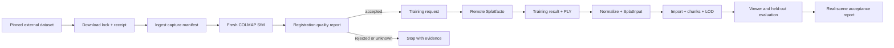

# Nantai 3D Production V1 Real Reconstruction Golden Path Design

Date: 2026-07-26

Status: approved 2026-07-26; implementation plan prepared

Program objective: turn the current Preview into a production product for
image/video ingestion, explicit coordinate alignment, mixed reconstruction,
spatial replacement, variable quality, Gaussian splatting and replaceable
assets.

## 1. Scope and program decomposition

The production objective spans several independently reviewable systems. It
must not be represented as one giant implementation task or reduced to a more
polished synthetic demo.

The program is split into five ordered subprojects:

1. **Real reconstruction golden path** — this specification. Produce one
   repeatable, non-mock SfM and 3DGS run with closed provenance, measurable
   quality, packaged Viewer output and a negative/corruption path.
2. **Cross-platform Studio operations** — enable safe image/video ingest,
   reconstruction, remote training, cancellation, resume and recovery on
   macOS and Windows instead of limiting verified writes to Windows/NTFS.
3. **Mixed-session scene revisions** — productize FrameGraph alignment,
   image/video session fusion, overlap policy, regional replacement, revision
   comparison and rollback.
4. **Production presentation and replaceable assets** — close the real
   3DGS/mesh composition, material replacement, seam presentation, streaming
   performance and visual-quality gates.
5. **Production distribution** — installer, private-data separation,
   upgrades, support bundle, security review and a release verified from
   downloaded bytes.

Completing this first subproject is necessary but does not by itself complete
Production V1. The program remains incomplete until all five subprojects pass
their own specifications and the final end-to-end audit.

## 2. Approved direction

The approved route is a real-data-first vertical slice with four architectural
layers:

```text
Capture
  → Reconstruction
    → Scene
      → Product
```

Two datasets serve different trust roles:

- **Internal canary:** Nerfstudio `poster`, fetched only on demand and pinned to
  Hugging Face dataset repository commit
  `461701c17e83c3f4d2481db32315aa7df703d2f8`. The pinned `poster/` tree has
  408 files and 379,280,986 declared bytes, including 100 original images and
  three 100-image downsample levels. Its dataset card does not declare a
  redistribution license, so it is internal-only and must never enter a
  Nantai source commit or Release asset.
- **Production acceptance capture:** images and/or video for which the operator
  has explicit processing and distribution rights. This capture is not yet
  present in the repository. Production release remains blocked until its
  acceptance receipt exists.

The internal canary proves that the software can process real captured imagery.
It does not grant commercial rights, metric scale or permission to call an
unrelated future capture accepted.

## 3. Current-state boundary

The repository already contains real implementations that this design reuses:

- `pipeline.ingest` and `pipeline.ingest_manifest` for content-addressed image
  and video sessions;
- `pipeline.registration` plus COLMAP 4.1.0 for non-mock camera registration;
- `pipeline.registration_quality` for operator-supplied, content-addressed SfM
  coverage policy and fail-closed decisions;
- `pipeline.training_provenance` for request/result/config/input/output closure;
- `scripts.prepare_import` and `pipeline.reconstruct` for `SplatInput`,
  multi-scene import, merge, LOD and manifest emission;
- `pipeline.gaussian_scene` for explicit-frame transforms, merge, importance
  deduplication and regional replacement;
- `pipeline.alignment` for Sim3/control-point/GPS alignment;
- `scripts.verify_recon_artifacts` and `scripts.inspect_recon` for artifact
  integrity and human-readable trust limits;
- Spark/Three Viewer layers for full 3DGS, spatial chunks and explicit fallback;
- Studio job/ledger infrastructure, although verified write durability is
  currently restricted to Windows/NTFS.

The current sample `input/` is not acceptance data: it consists of five
320×240 test images and one 320×240, three-second test video. Preview2 is a
synthetic scene and cannot satisfy this specification.

## 4. Trust model

Package integrity, source-media claims, geometry usability and render quality
remain separate.

### 4.1 Dataset source record

A new canonical `real-dataset-source.v1` tagged-union document supports
`hf-dataset` and `local-capture` sources. The internal canary instance records:

```json
{
  "schema": "nantai.real-dataset-source.v1",
  "dataset_id": "nerfstudio-poster-internal-canary",
  "role": "internal-canary",
  "source_kind": "hf-dataset",
  "repository": "nerfstudioteam/datasets",
  "repository_revision": "461701c17e83c3f4d2481db32315aa7df703d2f8",
  "subtree": "poster",
  "declared_file_count": 408,
  "declared_total_bytes": 379280986,
  "license_status": "not-declared",
  "redistribution_allowed": false,
  "release_inclusion_allowed": false
}
```

The source record is a fetch and policy contract, not proof that every image is
a photograph. Image origin remains an operator/source claim. The pipeline may
report `source_origin_claim=real-capture`, but must not convert that claim into
measured geometry or metric trust.

A `local-capture` source never stores a private absolute path in a portable
receipt. Its media identity comes from the content-addressed ingest manifest.
It additionally references a separate rights receipt with operator, scope,
date and allowed processing/distribution purposes. That receipt is an
authorization record, not geometry evidence.

### 4.2 Download lock and receipt

Before bytes are used, the downloader resolves the complete pinned subtree and
writes:

- `dataset-lock.json` — ordered relative paths, immutable revision, size and
  server-provided content identity for every file;
- `dataset-receipt.json` — actual downloaded SHA-256 and byte length for every
  file, plus the SHA-256 of `dataset-lock.json`;
- `dataset-policy.json` — internal-only/no-release policy copied from the source
  record.

The receipt is accepted only when all paths are safe children, the set is
exact, every actual size and SHA matches, and no redirect changes the
repository/revision identity. The initial response must identify the pinned
repository commit. An HTTPS redirect is allowed only to the downloader's
closed Hugging Face content-host policy, without forwarding credentials, and
the downloaded length and SHA are still re-derived locally. Revalidation
occurs before every resumed stage.

### 4.3 Existing evidence remains authoritative

No new report may directly set `geometry_usability`, `scale_status` or
`alignment_status`. Those remain derived from existing coordinate and
transformation evidence. In particular:

- successful download does not prove good SfM;
- successful SfM does not prove successful 3DGS;
- successful 3DGS does not prove metric scale;
- package verification does not raise scene trust;
- an internal canary never authorizes commercial redistribution.

## 5. Architecture and components

### 5.1 Capture layer

The capture layer accepts a source record plus an explicit selection of original
images or video. For the internal canary, only `poster/images/` is an input;
precomputed `transforms.json`, database and sparse models are retained as
diagnostic references and are not accepted as evidence for the fresh SfM run.

Processing is:

```text
verified dataset receipt
  → pipeline.ingest
  → capture manifest
  → check_capture diagnostic
  → registration request
```

Downsampled image folders are allowed only for smoke/performance probes. A
smoke run cannot be reused as a quality-acceptance run because the input
binding differs.

### 5.2 Reconstruction layer

The local Mac performs:

- source verification;
- ingest and capture report;
- COLMAP CPU feature extraction, matching and sparse reconstruction;
- registration quality decision;
- import, optional alignment, chunking, Viewer verification and report
  generation.

Mac Brush is a preview backend. It may validate plumbing and estimate resource
cost, but its result is not the Production V1 quality artifact.

The production-quality backend is Nerfstudio Splatfacto on a CUDA GPU. It uses
the existing `TrainingRequest`/`TrainingResult` handshake and
`cloud/train_3dgs_nerfstudio.sh`, with a new provider-neutral executor boundary:

```text
TrainingExecutor.prepare(request) → immutable job bundle
TrainingExecutor.submit(bundle) → external job id
TrainingExecutor.poll(job id) → queued | running | succeeded | failed | unknown
TrainingExecutor.fetch(job id) → result bundle
```

The first implementation supports:

- `local-brush`, explicitly `preview-only`;
- `remote-shell-nerfstudio`, using an operator-configured SSH host with CUDA.

Credentials, private keys and private host addresses live outside the
repository and outside release receipts. The executor records the non-secret
pinned host-key fingerprint, trainer/container identity, command argv, exit
code and output hashes without recording secret values or the private address.

Nerfstudio's dataparser normally may orient, centre and scale camera poses.
The accepted golden path must instead request `orientation_method=none`,
`center_method=none`, `auto_scale_poses=false` and `scale_factor=1.0`, then
bind and revalidate Nerfstudio's saved dataparser transform. It must be the
identity transform with scale 1.0 before the exported PLY can claim the local
COLMAP `sfm-local` frame. A missing or non-identity transform leaves training
content closure intact but makes the result ineligible for import; it must not
be repaired by guessing an inverse or by silently rotating high-order SH.

An interrupted or unreachable remote job becomes `unknown`, not `failed` or
`succeeded`. Resume requires the same request SHA, dataset receipt SHA, config
SHA, trainer identity and remote job id.

### 5.3 Scene layer

The trained PLY is normalized and imported through the existing `SplatInput`
contract. The canary initially remains:

```text
frame = sfm-local
units = arbitrary
alignment = unaligned
```

This is intentional. The public canary has no owned control-point survey and
must not be given a metric label.

The production acceptance capture additionally requires:

- at least four non-coplanar measured control points spanning the usable scene;
- a content-addressed Sim3 transform into a declared project frame;
- units `metre`;
- alignment RMS at or below 0.25 m;
- no contradictory or missing transform-history entry.

Chunking is pure spatial repackaging. It preserves coordinates and provenance.
No chunk, LOD or merge operation can upgrade trust.

Mixed-session fusion and regional replacement use the existing
`GaussianScene.merge`, `deduplicate` and `replace_region` primitives, but their
product policy is deliberately deferred to subproject 3. This golden path
creates one scene revision and the evidence format later revisions must
consume.

### 5.4 Product layer

This subproject adds one reusable golden-path command and read surfaces before
opening general Studio writes:

```text
python make.py real-scene SOURCE=<source-record> <target>
```

`python make.py real-canary <target>` is a convenience wrapper that binds
`SOURCE` to the pinned internal poster source. It has no separate execution
logic and cannot be used for a Production V1 acceptance decision.

Required targets are:

- `fetch` — pin and verify the internal dataset;
- `sfm` — ingest, COLMAP and registration quality;
- `train-preview` — optional local Brush plumbing run;
- `train-production` — remote Splatfacto run;
- `import` — normalize, import and chunk;
- `accept` — generate the aggregate acceptance report;
- `serve` — start Studio/Viewer against the accepted artifact;
- `all` — resume-safe ordered execution.

Every target prints the immutable input/request identity it consumes and the
receipt it produces. `--resume` never means “file exists”; it means every input
and policy identity matches.

Studio remains read-only for this subproject but gains an evidence view that
shows the real run stages and their exact accepted/rejected/unknown states.
Cross-platform write operations are subproject 2, where macOS durability and
single-writer semantics receive their own design and tests.

## 6. Data flow



The aggregate `real-scene-acceptance.v1` report contains only references and
derived decisions. It binds:

- dataset source, lock and receipt SHA;
- capture manifest and capture-quality report SHA;
- registration result, policy and quality-report SHA;
- training request, result, config, log and PLY SHA;
- SplatInput, recon manifest and every artifact-integrity receipt SHA;
- render-evaluation policy and report SHA;
- Viewer-performance policy and report SHA;
- coordinate/alignment evidence;
- final decision and explicit rejection reasons.

The validator reopens all referenced local bytes, recomputes every SHA and
re-derives all decisions. Self-reported booleans are not trusted.

## 7. Quality and acceptance policy

### 7.1 Internal canary SfM gate

The pinned 100 original images use an explicit
`RegistrationQualityPolicy`:

```text
min_registered_count = 90
min_registered_ratio = 0.90
min_session_coverage_ratio = 0.90
max_unregistered_consecutive_run = 5
min_largest_connected_model_share = 0.95
```

The run uses a non-mock COLMAP engine and a verified capture-manifest binding.
Failure does not cause threshold relaxation; it causes root-cause analysis or a
new, separately approved policy revision.

### 7.2 Training gate

Production training must satisfy all existing provenance checks and:

- trainer is `nerfstudio-splatfacto` with an exact version/container digest;
- CUDA device and driver observations are present;
- exit code is zero and state is `succeeded`;
- exported PLY exists, is semantically valid and contains finite positions,
  nonzero finite quaternions, opacity, scale, DC and a contiguous SH schema;
- output contains at least 100,000 Gaussians;
- request/config/input/output/log closure validates with no unapproved drift.

Gaussian count is a completeness sanity check, not a visual-quality metric.

### 7.3 Held-out image gate

Training uses a deterministic 90/10 split derived from the ordered pair of
source-image content SHA and canonical capture-manifest entry id, not filename
order. For the 100-image canary, exactly 10 images are held out. Held-out images
may participate in COLMAP camera estimation so they receive registered camera
poses, but their pixels never participate in 3DGS training, appearance
optimization or training-time loss.

The production artifact must achieve all of:

```text
mean PSNR >= 24.0 dB
mean SSIM >= 0.80
mean LPIPS <= 0.25
no held-out frame PSNR < 18.0 dB
```

Metrics are computed by a pinned evaluator/container and bound to the exact
camera, source-image and rendered-image SHAs. The content-addressed
`render-evaluation-policy.v1` fixes resolution, crop, colour space, alpha/mask
handling, SSIM window parameters and LPIPS backbone; the thresholds above are
valid only for that exact policy. It does not replace visual review for
floaters, holes, exposure seams or view-dependent failures.

### 7.4 Viewer gate

On the current supported Apple Silicon Mac at 1280×720:

```text
first interactive frame <= 10 seconds from navigation
median frame time <= 33.3 ms after a 120-frame warmup
p95 frame time <= 50.0 ms over the next 600 frames
no browser error or unhandled rejection
no indefinite loading state
no horizontal document overflow
```

The test covers the default full 3DGS representation and at least three camera
positions. Point/DC fallback results are reported separately and cannot satisfy
the full-3DGS gate. The report records the exact Mac model, SoC, memory, macOS,
browser, renderer capability and artifact identities. Timings begin from a
fresh browser context with an empty HTTP/browser cache while the accepted
artifact is served from the local Studio server; changing this protocol
requires a new performance-policy identity.

### 7.5 Human visual gate

Reviewers inspect fixed content-addressed camera poses for:

- missing foreground or scene envelope;
- floaters and duplicate surfaces;
- unstable view-dependent colour;
- obvious exposure or session seams;
- transparent/glass/water failure;
- navigable-space holes;
- disagreement between displayed representation and fidelity label.

Each disposition is `accepted`, `rejected` or `unknown`, with reviewer, policy
SHA and screenshot/render SHA. A missing review is `unknown` and blocks the
production decision.

## 8. Error handling and recovery

Every stage has four states:

```text
not-started | running | succeeded | failed | unknown
```

- Integrity, policy or semantic validation failures are terminal `failed`.
- Process loss with a known nonzero exit code is `failed`.
- Network loss, lost lease or unverifiable remote state is `unknown`.
- A stage is `succeeded` only after outputs are locally downloaded and verified.
- Downstream stages never start from `failed` or `unknown`.
- Retry creates a new attempt record while retaining the previous evidence.
- Resume is allowed only when stage input identity, tool identity and output
  receipt still validate.
- Cancellation requests cancellation but reports the observed terminal state;
  it never rewrites a completed remote run to “cancelled”.

The Viewer may offer an explicitly labelled fallback after a model error, but
fallback success does not change the failed production representation.

## 9. Security, privacy and licensing

- External datasets are stored below ignored `.nantai-studio/real-canary/`.
- Private captures, EXIF, GPS, control points, SSH configuration and cloud logs
  are excluded from source commits and public Releases by default.
- Release builders fail if a source record has
  `release_inclusion_allowed=false` or an unknown license.
- Download and remote-execution paths reject traversal, symlinks escaping the
  project, unsafe archive members and unapproved cross-origin redirects.
  Hugging Face's pinned resolver may redirect to an approved HTTPS
  `*.cdn.hf.co` content host only when the origin response identifies the exact
  requested repository commit; credentials are not forwarded and the final
  bytes must match the lock and receipt.
- Cloud credentials are never accepted as job parameters, written to ledgers or
  included in support bundles.
- Support bundles contain bounded diagnostics and hashes, not input images,
  exact private GPS or raw trainer logs unless the operator explicitly exports
  a separate private bundle.

## 10. Testing strategy

### 10.1 Unit and contract tests

- dataset source/lock/receipt canonicalization and tamper rejection;
- unsafe path, redirect, wrong revision, wrong size and wrong SHA rejection;
- executor state normalization, secret redaction and lost-job `unknown`;
- aggregate acceptance re-derivation and contradictory-claim rejection;
- deterministic held-out split and metric policy boundary tests;
- release exclusion for internal-only and private inputs.

### 10.2 Integration tests

- tiny local HTTP fixture for download/redirect/corruption behavior;
- fake remote executor for queued/running/succeeded/failed/unknown transitions;
- real COLMAP on a small committed synthetic fixture only to exercise invocation;
- real internal poster COLMAP as a non-CI acceptance job;
- local Brush smoke with a bounded step count;
- remote Splatfacto canary with exact container digest;
- imported PLY, chunks, LOD and Viewer artifact verification.

### 10.3 End-to-end acceptance

The internal canary is executed from an empty ignored workspace. Its complete
receipt is revalidated on another clean checkout without copying any cache
metadata. The final report must show which requirements it proves and which
remain blocked on the production acceptance capture.

The production acceptance capture repeats the same pipeline and adds measured
control-point alignment. It is the only dataset run that can satisfy the
Production V1 real-scene data gate; the release also remains blocked until
subprojects 2–5 pass.

## 11. Deliverables

This subproject is complete when all of the following exist and verify:

1. pinned internal dataset source, lock, downloader and receipt validator;
2. one-command, resume-safe source-parameterized golden-path runner plus the
   canary convenience wrapper;
3. real non-mock COLMAP report meeting the frozen SfM policy;
4. verified local Brush preview receipt;
5. verified remote Splatfacto request/result and semantically valid PLY;
6. imported full 3DGS plus chunks/LOD and artifact-integrity receipt;
7. held-out render metrics and human visual-review receipt;
8. real-browser performance report on the supported Mac;
9. aggregate `real-scene-acceptance.v1` validator and report;
10. Studio evidence presentation without trust promotion;
11. corruption and lost-remote-job drills;
12. documentation that distinguishes internal canary, production capture and
    remaining program subprojects.

The formal product remains incomplete after these deliverables until the
production acceptance capture and subprojects 2–5 also pass.
